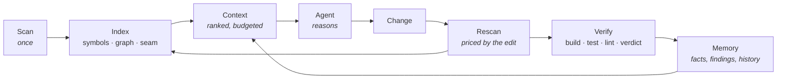

<div align="center">

# Nexus

### Engineering judgment for coding agents

*Understands the project once, and remembers it.*

[](https://github.com/zorigtbaatarAst/nexus/actions/workflows/ci.yml)
[](https://www.rust-lang.org)
[](#nexus-on-itself)
[](LICENSE)
[](docs/mcp-api.md)

***English** · [Монгол](README.md)*

</div>

---

## Start here

| What you want | Go to |
|---|---|
| Install it and try it | [Install](#install) → [Commands](#commands) |
| Understand what it is for | [The problem](#the-problem) → [Four rules](#four-rules) |
| See whether it actually works | [Proof](#proof) |
| Wire it into Claude Code | [Claude Code plugin](#claude-code-plugin) |
| Work on the code itself | [AGENTS.md](AGENTS.md) → [Built with](#built-with) |
| Read everything | [Documentation](#documentation) |

---

## The problem

Modern coding agents reason well. Given the right five files and the right three facts, they
produce work a competent engineer would sign off on.

The failure happens **before** the reasoning. The agent does not know which five files, does
not know the three facts, and has no way to find out except by reading — linearly,
expensively, into the very context window it then has to think inside of. Every other symptom
follows from that one.

> **Do not give AI more context. Give AI better context.**

More is easy and actively harmful: it costs tokens linearly, dilutes attention, and buries the
three lines that mattered under four hundred that did not. *Better* context is a **selection
problem** — and selection is ranking, ranking is deterministic computation, and deterministic
computation is nearly free.

Measured on this repository: chasing one dependency question by reading ten files costs about
**34,000 tokens**, and the answer is still an inference. From an index it is a proven result
in about **1,500 tokens**. That ratio is the whole point.

---

## Four rules

**1 · Deterministic first, probabilistic second.**
A model asked *"what calls this method?"* is slower, more expensive and **less accurate** than
an index. Spending tokens where a join would do is paying money to become worse.

**2 · Nexus owns evidence; the agent owns reasoning.**
Not a convenience — an honesty constraint: **the component that gathers the evidence must not
be the component that draws the conclusion.** A tool that both diagnoses and treats has
nothing checking it. Inside the code it becomes one rule: identity, lifecycle and storage
belong to the platform; **only rules** belong to a capability.

**3 · An expensive conclusion should be reached once.**
The agent that spent forty minutes last week working out that idempotency is enforced in the
controller and not the service knows nothing about it today. Nexus stores a fact with its
evidence, re-checks it on every scan, and invalidates it when the evidence moves — without
deleting it. Stale memory is the failure that reads as authority.

**4 · "Done" is a claim, not a fact.**
An agent finishes an edit and reports completion. Nothing compiles it, runs it, or lints it.
The agent is not lying — it genuinely **cannot tell**, because it has no verification channel
and never had one. Verification is the only thing that turns the claim into a fact.

---

## What it is

Nexus is not a coding agent, not a multi-agent framework, not a linter, an indexer or a RAG
system.

**Nexus is the thing that already knows the project**, so the agent working in it does not
have to rediscover it every session, one `Read` at a time, at full token price.

An experienced senior engineer joining your project does four things a fresh agent cannot:

| The senior engineer | Today's agent | What Nexus supplies |
|---|---|---|
| Knows what this system **is** before reading a file | Infers it from whatever file it opened first | `detect` profile, persisted |
| Knows this module **broke** last quarter, and how | Has no memory across sessions | Findings with history, facts with evidence |
| Knows a change here **reaches the frontend** | Cannot see it — nothing connects `fetch('/api/x')` to `@QueryMapping` | The GraphQL/HTTP seam in the dependency graph |
| Does not believe "done" until it **compiles and passes** | Says "done" | The verification gate |

Nexus is those four things, made queryable, persistent and cheap.

### The loop



The only run that reads the whole repository is the first `scan`. After that the cost is
**proportional to what changed, not to what exists**.

---

## Install

```bash
curl -fsSL https://raw.githubusercontent.com/zorigtbaatarAst/nexus/main/install.sh | sh
```

Downloads one file, verifies its checksum, installs it. No Java, no Node, no Docker.

```bash
cd /path/to/your/project
nexus scan                  # index and establish a baseline
nexus context --task "..."  # the ranked context for one task
nexus ask next              # where to start
```

Two binaries land: `nexus` is the platform, `bughunter` is the capability's own CLI. They are
one file under two names, told apart by `argv[0]`. There is no separate `init` step — `scan`
runs it when it needs to.

If anything misbehaves, run `nexus doctor`. It names what is missing and the command that
fixes it.

### Claude Code plugin

```
/plugin marketplace add zorigtbaatarAst/nexus
/plugin install nexus@nexus
```

Installs the MCP server, the slash commands, and a skill that tells the agent **when** to use
Nexus and **how to read** its answers. For the MCP server alone:
`claude mcp add --scope user nexus -- nexus mcp`.

Hooks are opt-in via `nexus init --hooks`. **Off by default** — installing unmeasured hooks
into someone's workflow without asking runs directly against what this project is for.

<details>
<summary>Other methods · updating · uninstalling</summary>

```bash
# build from source (needs Rust)
curl -fsSL .../install.sh | sh -s -- --from-source

# a specific version, a different directory
... | sh -s -- --version v0.3.0 --dir ~/bin

# uninstall
... | sh -s -- --uninstall

# if you cloned the repo
make install

# the Claude Code plugin updates separately
/plugin marketplace update nexus
```

The binary and the plugin are independent: updating one does not update the other. If the
database schema falls behind the binary, `nexus doctor` says so and `nexus rescan` fixes it.

</details>

---

## Commands

| Command | The question it answers |
|---|---|
| `nexus scan` · `rescan` | What is this? What changed? |
| `nexus context --task "…"` | What is needed for this task — ranked, budgeted, and **with its reasons** |
| `nexus impact <target>` | What breaks if I change this — across the whole stack |
| `nexus analyze [cap]` | `architect` · `review` · `bughunter` |
| `nexus verify` | Does it compile, pass and lint — judged against the baseline |
| `nexus fact` · `memory export` | Remember it; render it for a person |
| `nexus share export/import` | Between two machines — over a file, not a server |
| `nexus mcp` | 20 tools for any agent that speaks MCP |

Three capabilities read one index, one for each moment in the work:

| Moment | Capability | The question |
|---|---|---|
| First scan | **Architect** | What is this built from, and what is missing? |
| After an edit | **Review** | What does this change reach, and what tests it? |
| A suspected bug | **BugHunter** | Where is it, and what proves it? |

→ More: [cli-spec.md](docs/cli-spec.md) · [capabilities.md](docs/capabilities.md) ·
[mcp-api.md](docs/mcp-api.md)

---

## Proof

Not promises — three things that were **measured**.

### 1 · A reformat is not a change

A 109-file Spring Boot project, reformatted entirely. 14,000 lines moved on disk:

```
Changes
  109 files
  0 symbols        ← not one symbol changed
```

No more hunting phantom regressions after every `spotlessApply`. Change one line, though:

```
BODY_CHANGED    mn.life.wellbeing.service.WellbeingService#saveMeal(SaveMealInput)
```

That method. Not "WellbeingService.java changed".

### 2 · The frontend/backend seam

The hardest question: *"if I change this backend method, what breaks in the frontend?"*
`fetch()` and `@QueryMapping` are two functions in two languages with nothing in the source
text connecting them, which is why most tools cannot answer it. Nexus joins them **through the
GraphQL schema** — the contract both sides are generated from.

```
$ nexus impact 'mn.autoland.sales.vehicle.service.VehicleService#list' --paths

  0.81  VehicleGraphQLController#vehicles(...)
  0.57  graphql:Query.vehicles
  0.46  graphql:op:Vehicles
  0.37  frontend/src/app/(sales)/vehicles/page#VehiclesPage
  0.37  frontend/src/app/(sales)/components/NewSaleModal#NewSaleModal
  0.37  frontend/src/app/(sales)/components/VehicleSelect#VehicleSelect
  …
  7 crossing the frontend/backend seam
```

One line in a Java method puts **six React components** at risk, each shown with the path
that reaches it. Measured on a Java monorepo: 880 files, 5,665 symbols, **96%** of
in-project dependencies resolved, 641 ms. The rate is language-dependent — Java call sites
carry a qualified hint, Rust and JavaScript ones carry a bare method name, and this
repository resolves 45% (1,778 of 3,925 call sites, at `26b121d`).

That figure is *coverage* — the share of call sites that found a destination. It counts call
sites rather than edges because the ambiguous tiers write one edge per candidate, which made
the number rise as the resolver grew less certain.

Coverage is not accuracy, and the two are now measured separately. Against a
`rust-analyzer` SCIP oracle — a real compiler frontend, matched by position and never by
name — the destinations are right **72.3%** of the time per edge ([0.700–0.745], 1,528 edges
judged), and **71.5%** of call sites resolve to exactly one candidate and that candidate is
correct. Rust only, this repository only, 1,368 of 4,232 sites comparable: `make eval` and
[`docs/eval/`](docs/eval/README.md) carry the method and the caveats.

### 3 · Nexus indexes itself

The most honest test of a tool is running it on itself:

```
289 files · 2,074 symbols · 4,879 dependencies
```

That number used to be **0 symbols, 0 dependencies**. Nexus could describe every project
except the one it is. The Rust analyzer closed that gap.

---

## Principles

1. **Checkable evidence beats an AI guess.** A finding without a `file:line` is not ranked
   lower — it is rejected.
2. **AI is never required.** The deterministic build contains no HTTP client at all. Not a
   promise — a fact you can check with `cargo tree`.
3. **Your repository never leaves.** Context is a ranked, budgeted evidence set. There is no
   "just include the whole file" path.
4. **Production code is never touched.** Your working tree is never `checkout`ed, `stash`ed or
   `reset`. Generated files live in their own directory.
5. **Errors never pass silently.** A file it could not read is named. A truncated result says
   so. No baseline means a full scan **and a line saying that is what happened**.
6. **"Inconclusive" is an answer.** A suite that was already red says nothing about your
   change, so it reports `Inconclusive`, never `Failed`. A gate that cries wolf gets switched
   off once, and then verifies nothing forever.
7. **It asks rather than guesses.** Silently picking one of four candidates and sounding
   confident is the worst outcome: nobody ever learns it was a guess.

---

## Built with

**Rust · one static binary · SQLite · tree-sitter · git2.** 19 crates, ~37,000 lines, 478
tests.

Java · TypeScript · **JavaScript** · GraphQL · **Rust** · **Python** — six, working. Each sits behind the
`LanguageAnalyzer` interface and is **registered at the composition root**. Adding a language
is a new crate and one line at the root; the core is never touched. Framework knowledge
(Spring, Next.js, Django, FastAPI) is a separate axis — Spring is not Java.

| Layer | Crates |
|---|---|
| Types, storage, git | `nexus-types` · `nexus-store` · `nexus-vcs` |
| Languages | `nexus-lang` · `-java` · `-ts` · `-graphql` · `-rust` · `-python` · `-pack` |
| Core | `nexus-core` — index, graph, context, memory, finding lifecycle |
| Verification | `nexus-verify` — process execution, jail, sandbox |
| Capabilities | `cap-architect` · `cap-review` · `cap-bughunter` |
| Adapters | `nexus-mcp` · `nexus-cli` |

The boundaries are not a convention, they are a **test**:
`crates/nexus-cli/tests/boundaries.rs` reads `cargo metadata` and fails the build on a
violation.

### Nexus on itself

```bash
make check        # what CI runs: fmt · clippy (warnings are errors) · 478 tests
make eval         # is a resolved edge the *right* edge — against a SCIP oracle
make fixtures     # the benchmark corpus — from a spec, same sha every time
/nexus-architect  # derive the current state from the code, plan the next task
```

Read [`AGENTS.md`](AGENTS.md) first. The pinned constraints, the deliberate oddities and the
traps that cost real debugging time are all there.

---

## Documentation

| File | About |
|---|---|
| [AGENTS.md](AGENTS.md) | **read this first** — the briefing for agents |
| [docs/architecture/](docs/architecture/README.md) | 15 documents: vision, Context Engine, memory, verification, evaluation, phases 0–5 |
| [architecture.md](docs/architecture.md) · [architecture-decisions.md](docs/architecture-decisions.md) | layers, crates, boundaries · 26 ADRs |
| [data-model.md](docs/data-model.md) · [change-analysis.md](docs/change-analysis.md) | SQLite schema · change, impact, fingerprints |
| [memory-model.md](docs/memory-model.md) · [investigation.md](docs/investigation.md) | fact lifecycle · screenshot to suspect |
| [capabilities.md](docs/capabilities.md) · [mcp-api.md](docs/mcp-api.md) | the capability contract · MCP tools and permissions |
| [security.md](docs/security.md) · [verification-engine.md](docs/verification-engine.md) | safety, sandbox, secrets · verification |
| [cli-spec.md](docs/cli-spec.md) · [performance.md](docs/performance.md) · [roadmap.md](docs/roadmap.md) | CLI · performance · roadmap |

---

<div align="center">

**MIT** — [LICENSE](LICENSE)

*Nexus understands the project. Capabilities use that understanding.*

</div>
