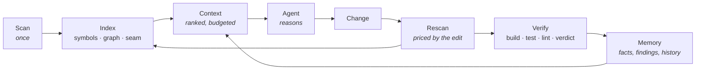

<div align="center">

# Nexus

### An engineering intelligence layer for AI coding agents

*Understand the codebase once. Remember it afterwards.*

[](https://github.com/zorigtbaatarAst/nexus/actions/workflows/ci.yml)
[](https://www.rust-lang.org)
[](#running-nexus-on-itself)
[](LICENSE)
[](docs/mcp-api.md)

***English*** · *[Монгол](README.md)*

</div>

---

## Philosophy

### The failure is not intelligence. It is not knowing

Modern coding agents reason well. Given the right five files and the right three facts, Claude
Code produces work a competent engineer would sign off on.

The failure happens **before** the reasoning. The agent does not know which five files, does
not know the three facts, and has no way to find out except by reading — linearly, expensively,
into the very context window it then has to think inside of.

Every other symptom follows from that one.

### Not more context. **Better** context

> **Do not give AI more context. Give AI better context.**

More is easy and actively harmful: it costs tokens linearly, dilutes attention, and buries the
three lines that mattered under four hundred that did not. *Better* context is a **selection
problem** — and selection is ranking, ranking is deterministic computation, and deterministic
computation is nearly free.

Measured on this repository: chasing one dependency question by reading ten files costs about
**34,000 tokens**, and the answer is still an inference, because it is written down nowhere. The
same question answered from an index is a proven result in about **1,500 tokens**. That ratio
is the product.

### The division of labour

> **Nexus owns evidence, history and verification. The agent owns reasoning.**

This is not a convenience, it is an honesty constraint: **the component that gathers the
evidence must not be the component that draws the conclusion.** That is what creates an
independent check. A tool that both diagnoses and treats has nothing checking it.

Inside the code it becomes one rule: identity, lifecycle and storage belong to the platform;
**only rules** belong to a capability.

### Deterministic first, probabilistic second

Every question is asked of a query first and a model second, and most questions never reach a
model at all.

This is not asceticism. A model asked *"what calls this method?"* is slower, more expensive and
**less accurate** than an index. Spending tokens where a join would do is paying money to
become worse.

### Memory is not having to work it out twice

The agent that spent forty minutes last Tuesday working out that idempotency is enforced in the
controller and not the service knows nothing about it today. That conclusion cost real tokens
and real wall-clock time, and it evaporated when the session ended.

> **An expensive conclusion should be reached once.**

Nexus stores a fact with its evidence, re-checks it on every scan, and invalidates it when the
evidence moves — without deleting it. Stale memory is the failure that reads as authority.

### "Done" is a claim

An agent finishes an edit and reports completion. Nothing compiles it, runs it, or lints it. The
agent is not lying — it genuinely **cannot tell**, because it has no verification channel and
never had one.

> **"Done" is a claim about the world. Verification is the only thing that makes it a fact.**

---

## What it is

Nexus is not a coding agent, not a multi-agent framework, not a linter, an indexer or a RAG
system.

**Nexus is the thing that already knows the project**, so the agent working in it does not have
to rediscover it every session, one `Read` at a time, at full token price.

An experienced senior engineer joining your project does four things a fresh agent cannot:

| The senior engineer | Today's agent | What Nexus supplies |
|---|---|---|
| Knows what this system **is** before reading a file | Infers it from whatever file it opened first | `detect` profile, persisted |
| Knows this module **broke** last quarter, and how | Has no memory across sessions | Findings with history, facts with evidence |
| Knows a change here **reaches the frontend** | Cannot see it — nothing connects `fetch('/api/x')` to `@QueryMapping` | The GraphQL/HTTP seam in the dependency graph |
| Does not believe "done" until it **compiles and passes** | Says "done" | The verification gate |

Nexus is those four things, made queryable, persistent and cheap.

---

## The loop



The only run that reads the whole repository is the first `scan`. After that the cost is
**proportional to what changed, not to what exists**.

---

## Install

```bash
curl -fsSL https://raw.githubusercontent.com/zorigtbaatarAst/nexus/main/install.sh | sh
```

One file, checksum-verified. No Java, no Node, no Docker.

```bash
cd /path/to/your/project

nexus scan                      # index and set the baseline
nexus rescan                    # what changed, and what that touches
nexus context --task "..."      # what this task needs, ranked
nexus analyze                   # run a capability
nexus verify                    # build · test · lint → verdict
nexus ask next                  # what is worth looking at first
```

Two binaries: `nexus` is the platform, `bughunter` is the capability's own CLI. One image under
two names, decided by `argv[0]`. There is no separate `init` step — `scan` prepares what it
needs.

### As a Claude Code plugin

```
/plugin marketplace add zorigtbaatarAst/nexus
/plugin install nexus@nexus
```

That installs the MCP server, the slash commands, and a skill that tells the agent **when** to
reach for Nexus and **how to read** the answers. MCP server only:
`claude mcp add --scope user nexus -- nexus mcp`.

Hooks are enabled with `nexus init --hooks` and ship **off by default**. Putting an unmeasured
hook on a developer's critical path is precisely the change to how they work that this project
refuses to make.

<details>
<summary>Other methods · updating · uninstalling</summary>

```bash
# build from source (needs Rust)
curl -fsSL .../install.sh | sh -s -- --from-source

# a specific version, a different directory
... | sh -s -- --version v0.3.0 --dir ~/bin

# uninstall
... | sh -s -- --uninstall

# from a clone
make install

# the Claude Code plugin updates separately
/plugin marketplace update nexus
```

The binary and the plugin are independent: updating one does not update the other. If the
schema is older than the binary, `nexus doctor` says so and `nexus rescan` fixes it.

</details>

If something goes wrong, run `nexus doctor`. It names what is missing and the command that
fixes it.

---

## Proof

Three claims, measured rather than promised.

### 1 · A reformat is not a change

A 109-file Spring Boot project, reformatted end to end — 14,000 lines moved on disk:

```
Changes
  109 files
  0 symbols        ← not one symbol changed
```

So `spotlessApply` does not start a witch hunt. Change one line inside one method, though:

```
BODY_CHANGED    mn.life.wellbeing.service.WellbeingService#saveMeal(SaveMealInput)
```

That method. Not the blurred answer "WellbeingService.java changed".

### 2 · The frontend/backend seam

The hardest question is *"if I change this backend method, what breaks in the frontend?"* Most
tools cannot answer it, because `fetch()` and `@QueryMapping` are two unrelated functions in two
different languages with nothing in the source text connecting them. Nexus connects them
**through the GraphQL schema**, because the schema is the contract both sides were generated
against.

```
$ nexus impact 'mn.autoland.sales.vehicle.service.VehicleService#list' --paths

  0.81  VehicleGraphQLController#vehicles(...)
  0.57  graphql:Query.vehicles
  0.46  graphql:op:Vehicles
  0.37  frontend/src/app/(sales)/vehicles/page#VehiclesPage
  0.37  frontend/src/app/(sales)/components/NewSaleModal#NewSaleModal
  0.37  frontend/src/app/(sales)/components/VehicleSelect#VehicleSelect
  …
  7 crossing the frontend/backend seam
```

One line in a Java method puts **six React components** at risk, with the chain that proves it.
Measured: 880 files, 5,665 symbols, **96 % of in-project dependencies resolved**, 641 ms.

### 3 · Nexus indexes itself

The most honest test of the tool is running it on itself:

```
261 files · 1,831 symbols · 4,158 edges
```

That number used to be **0 symbols and 0 edges** — Nexus could describe every project except
the one it is. The Rust analyzer closed that gap.

---

## What it does

| Command | The question it answers |
|---|---|
| `nexus scan` · `rescan` | What is this? What changed? |
| `nexus context --task "…"` | What does this task need — ranked, budgeted, **with the reason each item is in or out** |
| `nexus impact <target>` | What breaks if I change this — across the whole stack |
| `nexus analyze [cap]` | `architect` · `review` · `bughunter` |
| `nexus verify` | Does it compile, pass and lint — judged against the baseline |
| `nexus fact` · `memory export` | Remember it; render it for a human |
| `nexus share export/import` | Between two machines, over a file rather than a server |
| `nexus mcp` | 19 tools for any MCP-speaking agent |

Three capabilities read that one index, one for each moment of working with an agent:

| Moment | Capability | The question |
|---|---|---|
| The first scan | **Architect** | What is this project built from, and what does working in it lack? |
| After an edit | **Review** | What does this change reach, and what covers it? |
| A suspected bug | **BugHunter** | Where is it, and what proves it? |

---

## Principles

1. **Checkable evidence beats an AI's guess.** A finding without a `file:line` is not stored —
   not down-ranked, refused.
2. **AI is optional.** The deterministic build carries no HTTP client at all — not a promise, a
   fact you can check with `cargo tree`.
3. **The repository never leaves whole.** Context is a ranked, token-bounded set of evidence.
   There is no "include the whole file" path.
4. **Production code is never modified.** Generated files live in a jail; your working tree is
   never `checkout`ed, `stash`ed or `reset`.
5. **Errors never pass silently.** A file that could not be read is named; a truncated result
   says it was truncated; a missing baseline falls back to a full scan **and says so**.
6. **Inconclusive is an answer.** A suite that was already red proves nothing about the change,
   so the verdict is `Inconclusive`, never `Failed`. A gate that cries wolf is switched off
   once, and then it verifies nothing at all.
7. **Do not guess — ask.** Silently picking one of four possibilities and sounding confident is
   the worst outcome available: nobody ever learns it was a guess.

---

## Built with

**Rust · a single static binary · SQLite · tree-sitter · git2.** 18 crates, ~32,000 lines,
392 tests.

Java · TypeScript · GraphQL · **Rust** · **Python** all work. Each sits behind the
`LanguageAnalyzer` trait and is **registered at the composition root**: adding a language is a
new crate and one line, never an edit to the core. Framework knowledge (Spring, Next.js, Django,
FastAPI) is a separate axis — Spring is not Java.

| Layer | Crates |
|---|---|
| Types, storage, git | `nexus-types` · `nexus-store` · `nexus-vcs` |
| Language | `nexus-lang` · `-java` · `-ts` · `-graphql` · `-rust` · `-python` · `-pack` |
| Core | `nexus-core` — index, graph, context, memory, finding lifecycle |
| Verification | `nexus-verify` — process execution, the write jail, the sandbox |
| Capabilities | `cap-architect` · `cap-review` · `cap-bughunter` |
| Adapters | `nexus-mcp` · `nexus-cli` |

The boundaries are not conventions, they are **tests**: `crates/nexus-cli/tests/boundaries.rs`
reads `cargo metadata` and fails the build on a violation.

---

## Running Nexus on itself

```bash
make check        # what CI runs: fmt · clippy (a warning fails) · 392 tests
make fixtures     # the benchmark corpus, generated from specs, same sha every time
/nexus-architect  # derive the state from the code, then plan or implement the next task
```

Read [`AGENTS.md`](AGENTS.md) first — the invariants, the deliberate oddities, and the traps
that cost real debugging time to find.

---

## Documentation

| File | About |
|---|---|
| [AGENTS.md](AGENTS.md) | **start here** — the briefing for an agent working in this repo |
| [docs/architecture/](docs/architecture/README.md) | 14 documents: vision, Context Engine, memory, verification, evaluation, phases 0–5 |
| [architecture.md](docs/architecture.md) · [architecture-decisions.md](docs/architecture-decisions.md) | layers, crates, boundaries · 25 ADRs |
| [data-model.md](docs/data-model.md) · [change-analysis.md](docs/change-analysis.md) | the SQLite schema · change detection, impact, fingerprints |
| [memory-model.md](docs/memory-model.md) · [investigation.md](docs/investigation.md) | the fact lifecycle · screenshot to suspect |
| [capabilities.md](docs/capabilities.md) · [mcp-api.md](docs/mcp-api.md) | the capability contract · MCP tools and permissions |
| [security.md](docs/security.md) · [verification-engine.md](docs/verification-engine.md) | permissions, sandbox, secrets · verification |
| [cli-spec.md](docs/cli-spec.md) · [performance.md](docs/performance.md) · [roadmap.md](docs/roadmap.md) | CLI · performance · roadmap |

---

<div align="center">

**MIT** — [LICENSE](LICENSE)

*Nexus understands the project; capabilities use that understanding.*

</div>
