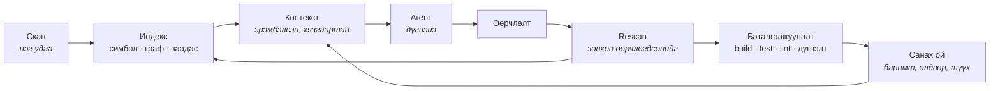

<div align="center">

# Nexus

### AI кодын агентын инженерийн оюун ухаан

*Кодыг нэг удаа ойлгоод, дараа нь санаж явдаг.*

[](https://github.com/zorigtbaatarAst/nexus/actions/workflows/ci.yml)
[](https://www.rust-lang.org)
[](#nexus-өөр-дээрээ)
[](LICENSE)
[](docs/mcp-api.md)

*[English](README.en.md) · **Монгол***

</div>

---

## Философи

### Дутагдаж байгаа нь ухаан биш, мэдлэг

Өнөөдрийн кодын агентууд маш сайн сэтгэдэг. Зөв таван файл, зөв гурван баримтыг л өгчихвөл
туршлагатай инженер батлахаар ажил гаргаж чадна.

Гэтэл асуудал сэтгэхээс өмнө үүсдэг. Аль таван файл вэ, ямар гурван баримт вэ — агент үүнийг
мэдэхгүй. Мэдэх цорын ганц арга нь уншиж эхлэх: файл файлаар, өндөр үнээр, яг тэр сэтгэх
ёстой контекст цонхоо дүүргэсээр.

Бусад бүх асуудал эндээс л эхэлдэг.

### Их контекст биш, зөв контекст

> **AI-д их контекст өгөх хэрэггүй. Зөв контекст өг.**

Ихийг өгөх амархан, гэхдээ хор хөнөөлтэй. Токен бүр мөнгө, анхаарал сарнина, хэрэгтэй гурван
мөр хэрэггүй дөрвөн зуун мөрийн дунд алга болно. Харин *зөв* контекст гэдэг бол сонголтын
асуудал. Сонголт гэдэг эрэмбэлэх асуудал, эрэмбэлэх гэдэг энгийн тооцоолол, энгийн тооцоолол
бараг үнэгүй.

Тоогоор хэлбэл: энэ repo дээр нэг хамаарлын асуултад хариулахын тулд арван файл уншвал
ойролцоогоор **34,000 токен** зарцуулна. Тэгээд ч хариулт нь хаана ч бичээгүй учир таамаг
хэвээр үлдэнэ. Индексээс авбал нотлогдсон хариулт ойролцоогоор **1,500 токен**. Энэ харьцаа л
бүтээгдэхүүн юм.

### Хэн юу хариуцах вэ

> **Nexus нотолгоо, түүх, баталгаажуулалтыг хариуцна. Агент дүгнэлтийг хариуцна.**

Энэ бол зүгээр л тохиромжтой хуваарилалт биш, шударга байдлын нөхцөл: **нотолгоо цуглуулдаг
нь дүгнэлт гаргадаг байж болохгүй.** Тэгж байж хөндлөнгийн хяналт бий болно. Онош тавьдаг нь
бас эмчилдэг бол түүнийг хэн ч шалгахгүй.

Код дээр энэ нэг дүрэм болж буудаг: таних тэмдэг, амьдралын мөчлөг, хадгалалт бол
платформынх. Capability зөвхөн **дүрмээ** л мэднэ.

### Эхлээд индексээс, дараа нь model-оос

Асуулт бүр эхлээд индексээс асуугдана. Model руу зөвхөн шаардлагатай үед л ханддаг, ихэнх
асуулт тэнд хүрдэг ч үгүй.

Энэ бол хэмнэлт биш, зөв байдал. *"Энэ методыг хэн дууддаг вэ?"* гэж model-оос асуувал
индексээс асуухаас удаан, үнэтэй, бас **буруу** хариулт авах магадлал өндөр. Нэг join хийхэд
болох газар токен зарцуулах нь мөнгө төлж чанараа муутгах хэрэг.

### Санах ой: олсноо дахин хайхгүй

Өнгөрсөн мягмар гарагт дөчин минут зарцуулж, idempotency нь service дээр биш controller дээр
шалгагддагийг олж мэдсэн агент өнөөдөр түүнийг санахгүй. Тэр дүгнэлт бодит токен, бодит цаг
зарцуулж гарсан ч сешн дуусахад алга болсон.

> **Үнэтэй дүгнэлтийг нэг л удаа гаргах ёстой.**

Nexus баримтыг нотолгоотой нь хамт хадгална, скан бүрт дахин шалгана. Нотолгоо нь
өөрчлөгдвөл баримтыг хүчингүй болгоно — гэхдээ устгахгүй. Хуучирсан санах ой бол хамгийн
аюултай алдаа: итгэлтэй сонсогддог.

### "Дууслаа" гэдэг зүгээр л мэдэгдэл

Агент ажлаа дуусгаад "дууслаа" гэж хэлэхэд түүнийг хэн ч компайл хийж, тест ажиллуулж
шалгадаггүй. Агент худлаа хэлж байгаа юм биш — тэр зүгээр л **мэдэх аргагүй**, учир нь шалгах
суваг нь хэзээ ч байгаагүй.

> **"Дууслаа" гэдэг бол мэдэгдэл. Баталгаажуулалт л түүнийг баримт болгоно.**

---

## Nexus гэж юу вэ

Nexus бол кодын агент биш, multi-agent framework биш, linter ч биш, indexer ч биш, RAG систем ч
биш.

**Nexus бол агентуудад зориулсан таны төслийн мэдлэгийн сан юм.** Тиймээс дотор нь ажиллаж байгаа агент сешн
бүрт, `Read` дуудлага бүрээр, бүтэн үнээр төслийг дахин танилцах шаардлагагүй.

Туршлагатай ахлах инженер шинэ төсөлд ирэхдээ шинэ агентын хийж чаддаггүй дөрвөн зүйлийг
хийдэг:

| Ахлах инженер | Өнөөдрийн агент | Nexus юу өгдөг вэ |
|---|---|---|
| Файл нээхээсээ өмнө энэ систем **юу болохыг** мэднэ | Анх нээсэн файлаасаа л таамаглана | `detect` профайл, хадгалагдсан |
| Энэ модуль өнгөрсөн улиралд **эвдэрснийг**, яаж эвдэрснийг мэднэ | Сешн хооронд юу ч санахгүй | Түүхтэй олдвор, нотолгоотой баримт |
| Энд хийсэн өөрчлөлт **frontend хүртэл хүрдгийг** мэднэ | Харж чадахгүй — `fetch('/api/x')`-ийг `@QueryMapping`-тай холбох зүйл кодонд байхгүй | Хамаарлын граф дахь GraphQL/HTTP заадас |
| Компайл хийж, тест давахаас нааш **"дууслаа" гэдэгт итгэдэггүй** | "Дууслаа" гээд л орхино | Баталгаажуулалтын хаалга |

Nexus бол яг энэ дөрөв — асууж болдог, санаж явдаг, хямд болгосон нь.

---

## Мөчлөг



Бүх repo-г уншдаг цорын ганц удаа бол анхны `scan`. Түүнээс хойш зардал **кодын хэмжээнээс
биш, өөрчлөлтийн хэмжээнээс** хамаарна.

---

## Суулгах

```bash
curl -fsSL https://raw.githubusercontent.com/zorigtbaatarAst/nexus/main/install.sh | sh
```

Нэг файл татаж, checksum-ыг нь шалгаад суулгана. Java, Node, Docker — юу ч хэрэггүй.

```bash
cd /таны/төслийн/зам

nexus scan                      # индекслээд baseline тавина
nexus rescan                    # юу өөрчлөгдсөн, тэр нь юунд нөлөөлөх вэ
nexus context --task "..."      # энэ ажилд хэрэгтэй контекстийг эрэмбэлж өгнө
nexus analyze                   # capability ажиллуулна
nexus verify                    # build · test · lint → дүгнэлт
nexus ask next                  # юунаас эхлэх вэ
```

Хоёр binary суугдана: `nexus` бол платформ, `bughunter` бол capability-ийн өөрийн CLI. Хоёулаа
нэг файл, зөвхөн нэрээрээ ялгаатай (`argv[0]`-оор таньдаг). `init` гэж тусад нь ажиллуулах
шаардлагагүй — `scan` хэрэгтэй бол өөрөө хийчихнэ.

### Claude Code plugin

```
/plugin marketplace add zorigtbaatarAst/nexus
/plugin install nexus@nexus
```

MCP сервер, slash командууд, мөн агентад Nexus-ийг **хэзээ** ашиглах, хариултыг нь **хэрхэн
унших**-ыг заасан skill суугдана. Зөвхөн MCP сервер хэрэгтэй бол:
`claude mcp add --scope user nexus -- nexus mcp`.

Hook-уудыг `nexus init --hooks` гэж асаана. **Анхнаасаа унтраастай** — хэмжээгүй hook-ыг
хүний ажлын урсгалд дуудалгүй оруулах нь энэ төслийн зорилгод шууд харш.

<details>
<summary>Бусад арга · шинэчлэх · устгах</summary>

```bash
# эх кодоос build хийх (Rust хэрэгтэй)
curl -fsSL .../install.sh | sh -s -- --from-source

# тодорхой хувилбар, өөр хавтас
... | sh -s -- --version v0.3.0 --dir ~/bin

# устгах
... | sh -s -- --uninstall

# repo-г clone хийсэн бол
make install

# Claude Code plugin тусдаа шинэчлэгдэнэ
/plugin marketplace update nexus
```

Binary болон plugin хоёр тусдаа: нэгийг нь шинэчлэхэд нөгөө нь шинэчлэгдэхгүй. Өгөгдлийн сангийн
схем binary-аас хоцорсон бол `nexus doctor` хэлж өгнө, `nexus rescan` засна.

</details>

Ямар нэг юм болохгүй бол `nexus doctor` ажиллуул. Юу дутуу байгааг, яаж засахыг командтай нь
хамт хэлнэ.

---

## Баталгаа

Амлалт биш — **хэмжсэн** гурван зүйл.

### 1 · Форматлах нь өөрчлөлт биш

109 файлтай Spring Boot төслийг бүхэлд нь дахин форматлав. Диск дээр 14,000 мөр хөдөлсөн:

```
Changes
  109 files
  0 symbols        ← нэг ч симбол өөрчлөгдөөгүй
```

`spotlessApply` ажиллуулах бүрт хоосон алдаа хайж цаг үрэхгүй. Харин нэг методын дотор нэг
мөр өөрчилбөл:

```
BODY_CHANGED    mn.life.wellbeing.service.WellbeingService#saveMeal(SaveMealInput)
```

Яг тэр метод. "WellbeingService.java өөрчлөгдлөө" гэсэн бүрхэг хариу биш.

### 2 · Frontend, backend хоёрын заадас

Хамгийн хэцүү асуулт: *"Backend-ийн энэ методыг өөрчилбөл frontend дээр юу эвдрэх вэ?"*
Ихэнх хэрэгсэл үүнд хариулж чаддаггүй. Учир нь `fetch()` ба `@QueryMapping` бол хоёр өөр хэл
дээрх, кодонд хоорондоо ямар ч холбоогүй хоёр функц. Nexus тэднийг **GraphQL схемээр** дамжуулан
холбоно — схем нь хоёр талын хоорондох гэрээ учраас.

```
$ nexus impact 'mn.autoland.sales.vehicle.service.VehicleService#list' --paths

  0.81  VehicleGraphQLController#vehicles(...)
  0.57  graphql:Query.vehicles
  0.46  graphql:op:Vehicles
  0.37  frontend/src/app/(sales)/vehicles/page#VehiclesPage
  0.37  frontend/src/app/(sales)/components/NewSaleModal#NewSaleModal
  0.37  frontend/src/app/(sales)/components/VehicleSelect#VehicleSelect
  …
  7 crossing the frontend/backend seam
```

Java методын нэг мөрийг өөрчлөхөд **зургаан React компонент** эрсдэлд орж байгааг, ямар
замаар холбогдож байгаатай нь хамт харууллаа. Хэмжилт: 880 файл, 5,665 симбол, дотоод
хамаарлын **96% нь холбогдсон**, 641 мс.

### 3 · Nexus өөрийгөө индекслэнэ

Хэрэгслийн хамгийн шударга шалгалт бол өөр дээр нь ажиллуулах:

```
261 файл · 1,831 симбол · 4,158 хамаарал
```

Урьд нь энэ тоо **0 симбол, 0 хамаарал** байсан. Nexus бүх төслийг тайлбарлаж чаддаг ч
өөрийгөө чаддаггүй байлаа. Rust анализатор энэ цоорхойг хаасан.

---

## Юу хийж чадах вэ

| Команд | Хариулах асуулт |
|---|---|
| `nexus scan` · `rescan` | Энэ юу вэ? Юу өөрчлөгдсөн бэ? |
| `nexus context --task "…"` | Энэ ажилд яг юу хэрэгтэй вэ — эрэмбэтэй, токены хязгаартай, **яагаад** гэдгийг нь хамт |
| `nexus impact <target>` | Үүнийг өөрчилбөл юу эвдрэх вэ — бүх stack даяар |
| `nexus analyze [cap]` | `architect` · `review` · `bughunter` |
| `nexus verify` | Компайл хийгдэж, тест давж, lint өнгөрч байна уу — baseline-тай харьцуулж |
| `nexus fact` · `memory export` | Санаж авах; хүн уншихаар гаргах |
| `nexus share export/import` | Хоёр машины хооронд — сервергүйгээр |
| `nexus mcp` | MCP ойлгодог ямар ч агентад зориулсан 19 tool |

Гурван capability нэг индексийг уншина. Ажлын гурван мөчид тус бүр нэг:

| Мөч | Capability | Асуулт |
|---|---|---|
| Анхны скан | **Architect** | Энэ төсөл юугаар бүтсэн бэ, юу дутуу байна вэ? |
| Засварын дараа | **Review** | Энэ өөрчлөлт юунд хүрэх вэ, юу үүнийг тестэлдэг вэ? |
| Сэжигтэй алдаа | **BugHunter** | Хаана байна вэ, юу нотолж байна вэ? |

---

## Зарчмууд

1. **Шалгаж болох нотолгоо AI-н таамгаас дээр.** `file:line` заагаагүй олдворыг
   хадгалахгүй — доогуур эрэмбэлэх биш, шууд хаяна.
2. **AI заавал хэрэггүй.** Детерминистик build дотор HTTP client огт байхгүй. Энэ амлалт биш,
   `cargo tree` ажиллуулаад шалгаж болох баримт.
3. **Repo-г бүхлээр нь хаашаа ч илгээхгүй.** Контекст гэдэг бол эрэмбэлсэн, токены хязгаартай
   нотолгооны багц. "Файлыг бүхлээр нь оруулъя" гэсэн зам байхгүй.
4. **Продакшн кодонд гар хүрэхгүй.** Үүсгэсэн файлууд тусгай хавтаст л амьдарна. Таны working
   tree хэзээ ч `checkout`, `stash`, `reset` хийгдэхгүй.
5. **Алдаа чимээгүй өнгөрөхгүй.** Уншиж чадаагүй файлаа хэлнэ. Тасарсан үр дүн тасарснаа
   хэлнэ. Baseline олдохгүй бол бүтэн скан хийгээд **тэрийгээ хэлнэ**.
6. **"Тодорхойгүй" гэдэг бас хариулт.** Урьд нь улаан байсан тест багц өөрчлөлтийн талаар юу ч
   хэлэхгүй. Тиймээс `Inconclusive` гэнэ, `Failed` гэхгүй. Дэмий сүрдүүлдэг хаалгыг нэг л удаа
   унтраадаг, түүнээс хойш юу ч шалгагдахаа болино.
7. **Таамаглахгүй, асууна.** Дөрвөн боломжоос нэгийг нь чимээгүй сонгоод итгэлтэй ярих нь
   хамгийн муу хувилбар: тэр таамаг байсныг хэн ч хэзээ ч мэдэхгүй.

---

## Технологи

**Rust · нэг статик binary · SQLite · tree-sitter · git2.** 18 crate, ~32,000 мөр, 394 тест.

Java · TypeScript · GraphQL · **Rust** · **Python** — тав нь ажиллаж байна. Хэл бүр
`LanguageAnalyzer` интерфейсийн ард байрлаж, **композицийн үндэс дээр бүртгэгддэг**. Шинэ хэл
нэмэх гэдэг шинэ crate, үндэс дээр нэг мөр — цөмд гар хүрэхгүй. Framework-ийн мэдлэг (Spring,
Next.js, Django, FastAPI) тусдаа өргөтгөлийн тэнхлэг — Spring гэдэг Java биш шүү дээ.

| Давхарга | Crate |
|---|---|
| Төрөл, хадгалалт, git | `nexus-types` · `nexus-store` · `nexus-vcs` |
| Хэл | `nexus-lang` · `-java` · `-ts` · `-graphql` · `-rust` · `-python` · `-pack` |
| Цөм | `nexus-core` — индекс, граф, контекст, санах ой, олдворын мөчлөг |
| Баталгаажуулалт | `nexus-verify` — процесс ажиллуулах, шорон, sandbox |
| Capability | `cap-architect` · `cap-review` · `cap-bughunter` |
| Адаптер | `nexus-mcp` · `nexus-cli` |

Хилүүд нь тохиролцоо биш, **тест**: `crates/nexus-cli/tests/boundaries.rs` `cargo metadata`-г
уншаад зөрчил байвал build-ийг унагана.

---

## Nexus өөр дээрээ

```bash
make check        # CI-ийн ажиллуулдаг: fmt · clippy (warning = алдаа) · 394 тест
make fixtures     # benchmark корпус — тодорхойлолтоос, үргэлж ижил sha
/nexus-architect  # кодоос одоогийн байдлыг тогтоож, дараагийн даалгаврыг төлөвлөнө
```

Эхлээд [`AGENTS.md`](AGENTS.md)-г унш. Хөдлөшгүй дүрмүүд, санаатай хийсэн сонин зүйлс, цаг
үрдэг урхинууд тэнд байгаа.

---

## Баримт бичиг

Техникийн баримт бичиг англи хэл дээр.

| Файл | Тухай |
|---|---|
| [AGENTS.md](AGENTS.md) | **эхлээд үүнийг** — агентад зориулсан танилцуулга |
| [docs/architecture/](docs/architecture/README.md) | 14 баримт: алсын хараа, Context Engine, санах ой, баталгаажуулалт, үнэлгээ, 0–5 үе шат |
| [architecture.md](docs/architecture.md) · [architecture-decisions.md](docs/architecture-decisions.md) | давхарга, crate, хил · 25 ADR |
| [data-model.md](docs/data-model.md) · [change-analysis.md](docs/change-analysis.md) | SQLite схем · өөрчлөлт, нөлөөлөл, fingerprint |
| [memory-model.md](docs/memory-model.md) · [investigation.md](docs/investigation.md) | баримтын амьдралын мөчлөг · дэлгэцээс сэжигтэн хүртэл |
| [capabilities.md](docs/capabilities.md) · [mcp-api.md](docs/mcp-api.md) | capability-ийн гэрээ · MCP tool, зөвшөөрөл |
| [security.md](docs/security.md) · [verification-engine.md](docs/verification-engine.md) | аюулгүй байдал, sandbox, нууц · баталгаажуулалт |
| [cli-spec.md](docs/cli-spec.md) · [performance.md](docs/performance.md) · [roadmap.md](docs/roadmap.md) | CLI · гүйцэтгэл · төлөвлөгөө |

---

<div align="center">

**MIT** — [LICENSE](LICENSE)

*Nexus төслийг ойлгодог. Capability-ууд тэр ойлголтыг ашигладаг.*

</div>
