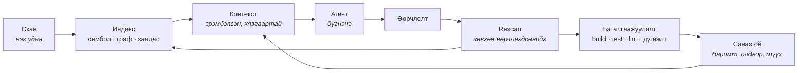

<div align="center">

# Nexus

### Кодын агентад зориулсан инженерийн ой ухаан

*Төслийг нэг удаа ойлгоод, цаашид санаж явна.*

[](https://github.com/zorigtbaatarAst/nexus/actions/workflows/ci.yml)
[](https://www.rust-lang.org)
[](#nexus-өөр-дээрээ)
[](LICENSE)
[](docs/mcp-api.md)

*[English](README.en.md) · **Монгол***

</div>

---

## Хаанаас эхлэх вэ

| Та юу хийхийг хүсэж байна | Энд оч |
|---|---|
| Шууд суулгаад үзэх | [Суулгах](#суулгах) → [Командууд](#командууд) |
| Юунд хэрэгтэйг нь ойлгох | [Асуудал](#асуудал) → [Дөрвөн дүрэм](#дөрвөн-дүрэм) |
| Үнэхээр ажилладаг эсэхийг харах | [Баталгаа](#баталгаа) |
| Claude Code-доо холбох | [Claude Code plugin](#claude-code-plugin) |
| Дотор нь орж ажиллах | [AGENTS.md](AGENTS.md) → [Технологи](#технологи) |
| Бүх баримтыг үзэх | [Баримт бичиг](#баримт-бичиг) |

---

## Асуудал

Өнөөдрийн кодын агентууд сайн сэтгэдэг. Зөв файл, зөв баримтыг нь өгчихвөл туршлагатай
инженертэй адил ажиллана.

Гэтэл асуудал сэтгэхээс өмнө эхэлдэг. **Аль файлыг унших вэ? Ямар баримт нь энэ ажилд
хамаатай вэ?** Агент үүнийг мэдэхгүй. Мэдэх ганц арга нь уншиж эхлэх — файл файлаар, өндөр
үнээр, яг тэр сэтгэх ёстой контекст цонхоо дүүргэсээр. Бусад бүх асуудал эндээс эхэлдэг.

> **AI-д их контекст өгөх хэрэггүй. Зөв контекстийг нь өг.**

Ихийг өгөх амархан ч хортой. Токен бүр мөнгө. Контекст дүүрэх тусам анхаарал сарниж чанар
унана. Хэрэгтэй гурван мөр хэрэггүй дөрвөн зуун мөрийн дунд алга болно.

Тоогоор: энэ repo дээр нэг хамаарлын асуултад хариулах гэж арван файл уншвал ~**34,000
токен**, хариулт нь бас таамаг хэвээр. Индексээс авбал нотлогдсон хариулт ~**1,500 токен**.
Яг энэ ялгаанд л бүх учир нь бий.

---

## Дөрвөн дүрэм

**1 · Эхлээд индексээс, дараа нь model-оос.**
*"Энэ методыг хэн дууддаг вэ?"* гэж model-оос асуувал индексээс асуухаас удаан, үнэтэй, бас
**буруу** байх магадлалтай. Нэг join хийхэд болох газар токен үрэх нь мөнгө төлж байж
чанараа мууруулж буй хэрэг.

**2 · Nexus нотолгоог, агент дүгнэлтийг хариуцна.**
Энэ бол ажлын хуваарь биш, шударга байдлын нөхцөл: **нотолгоо цуглуулдаг нь дүгнэлт гаргадаг
байж болохгүй.** Онош тавьдаг нь бас эмчилдэг бол түүнийг хэн ч шалгахгүй. Кодонд энэ нь нэг
дүрэм болж буудаг: таних тэмдэг, амьдралын мөчлөг, хадгалалт бол платформынх. Capability
зөвхөн **дүрмээ** мэднэ.

**3 · Үнэтэй дүгнэлтийг нэг л удаа гаргана.**
Өнгөрсөн долоо хоногт дөчин минут зарцуулж, idempotency нь service дээр биш controller дээр
шалгагддагийг олсон агент өнөөдөр түүнийгээ санахгүй. Nexus баримтыг нотолгоотой нь хамт
хадгална, скан бүрт дахин шалгана. Нотолгоо нь хөдөлбөл баримтыг хүчингүй болгоно — гэхдээ
устгахгүй. Хуучирсан санах ой хамгийн аюултай: итгэлтэй сонсогддог.

**4 · "Дууслаа" гэдэг мэдэгдэл, баримт биш.**
Агент "дууслаа" гэхэд түүнийг хэн ч компайл хийж, тест ажиллуулж шалгадаггүй. Агент худал
хэлж байгаа юм биш — тэр зүгээр л **мэдэх аргагүй**, учир нь шалгах суваг нь хэзээ ч
байгаагүй. Баталгаажуулалт л мэдэгдлийг баримт болгоно.

---

## Nexus гэж юу вэ

Nexus бол кодын агент биш. Multi-agent framework, linter, indexer, RAG систем ч биш.

**Nexus бол агентад зориулсан таны төслийн мэдлэгийн сан.** Ингэснээр дотор нь ажиллах агент
сешн бүрт, `Read` дуудлага бүрт төсөлтэйгээ бүтэн үнээр дахин танилцахаа болино.

Туршлагатай ахлах инженер шинэ төсөлд ирэхдээ шинэ агентын хийж чаддаггүй дөрвөн зүйл хийдэг:

| Ахлах инженер | Өнөөдрийн агент | Nexus юу өгөх вэ |
|---|---|---|
| Файл нээхээсээ өмнө энэ систем **юу болохыг** мэднэ | Анх нээсэн файлаасаа таамаглана | `detect` профайл, хадгалагдсан |
| Энэ модуль өнгөрсөн улиралд **эвдэрснийг**, яаж эвдэрснийг мэднэ | Сешн хооронд юу ч санахгүй | Түүхтэй олдвор, нотолгоотой баримт |
| Энд хийсэн өөрчлөлт **frontend хүртэл хүрдгийг** мэднэ | Харж чадахгүй — `fetch('/api/x')`-ийг `@QueryMapping`-тай холбох зүйл кодонд алга | Хамаарлын граф дахь GraphQL/HTTP заадас |
| Компайл хийгдэж, тест давахаас нааш **"дууслаа" гэдэгт итгэхгүй** | "Дууслаа" гээд орхино | Баталгаажуулалтын хаалга |

Nexus бол яг энэ дөрөв — асууж болохоор, санаж явдаг, хямд болгосон хувилбар.

### Мөчлөг



Бүх repo-г бүтнээр нь уншдаг цорын ганц үе бол анхны `scan`. Түүнээс хойш зардал **кодын
хэмжээнээс биш, өөрчлөлтийн хэмжээнээс** хамаарна.

---

## Суулгах

```bash
curl -fsSL https://raw.githubusercontent.com/zorigtbaatarAst/nexus/main/install.sh | sh
```

Нэг файл татаад checksum-ыг нь шалгаж суулгана. Java, Node, Docker — юу ч хэрэггүй.

```bash
cd /таны/төслийн/зам
nexus scan                 # индекслээд baseline тавина
nexus context --task "..."  # энэ ажилд хэрэгтэй контекст
nexus ask next             # юунаас эхлэх вэ
```

Хоёр binary суудаг: `nexus` бол платформ, `bughunter` бол capability-ийн өөрийн CLI. Хоёулаа
нэг файл, зөвхөн нэрээрээ ялгаатай (`argv[0]`-оор таньдаг). `init` гэж тусад нь ажиллуулах
шаардлагагүй — `scan` хэрэгтэй бол өөрөө хийчихнэ.

Ямар нэг юм болохгүй бол `nexus doctor` ажиллуул. Юу дутуу байгааг, яаж засахыг командтай нь
хамт хэлнэ.

### Claude Code plugin

```
/plugin marketplace add zorigtbaatarAst/nexus
/plugin install nexus@nexus
```

MCP сервер, slash команд, мөн агентад Nexus-ийг **хэзээ** ашиглах, хариултыг нь **хэрхэн
унших**-ыг заасан skill суудаг. Зөвхөн MCP сервер хэрэгтэй бол:
`claude mcp add --scope user nexus -- nexus mcp`.

Hook-уудыг `nexus init --hooks` гэж асаана. **Анхнаасаа унтраастай** — хүний ажлын урсгалд
асуулгүйгээр hook суулгах нь энэ төслийн зорилгод шууд харш.

<details>
<summary>Бусад арга · шинэчлэх · устгах</summary>

```bash
# эх кодоос build хийх (Rust хэрэгтэй)
curl -fsSL .../install.sh | sh -s -- --from-source

# тодорхой хувилбар, өөр хавтас
... | sh -s -- --version v0.3.0 --dir ~/bin

# устгах
... | sh -s -- --uninstall

# repo-г clone хийсэн бол
make install

# Claude Code plugin тусдаа шинэчлэгдэнэ
/plugin marketplace update nexus
```

Binary болон plugin хоёр тусдаа: нэгийг нь шинэчлэхэд нөгөө нь шинэчлэгдэхгүй. Өгөгдлийн
сангийн схем binary-аасаа хоцорсон бол `nexus doctor` хэлж өгнө, `nexus rescan` засна.

</details>

---

## Командууд

| Команд | Хариулах асуулт |
|---|---|
| `nexus scan` · `rescan` | Энэ юу вэ? Юу өөрчлөгдсөн бэ? |
| `nexus context --task "…"` | Энэ ажилд яг юу хэрэгтэй вэ — эрэмбэтэй, токены хязгаартай, **яагаад** гэдгийг нь хамт |
| `nexus impact <target>` | Үүнийг өөрчилбөл юу эвдрэх вэ — бүх stack даяар |
| `nexus analyze [cap]` | `architect` · `review` · `bughunter` |
| `nexus verify` | Компайл хийгдэж, тест давж, lint өнгөрч байна уу — baseline-тай харьцуулж |
| `nexus fact` · `memory export` | Санаж авах; хүн уншихаар гаргах |
| `nexus share export/import` | Хоёр машины хооронд — сервергүйгээр |
| `nexus mcp` | MCP ойлгодог ямар ч агентад зориулсан 20 tool |

Гурван capability нэг индексийг уншина. Ажлын гурван мөчид тус бүр нэг:

| Мөч | Capability | Асуулт |
|---|---|---|
| Анхны скан | **Architect** | Энэ төсөл юугаар бүтсэн бэ, юу дутуу байна вэ? |
| Засварын дараа | **Review** | Энэ өөрчлөлт юунд хүрэх вэ, юу үүнийг тестэлдэг вэ? |
| Сэжигтэй алдаа | **BugHunter** | Хаана байна вэ, юу нотолж байна вэ? |

→ Дэлгэрэнгүй: [cli-spec.md](docs/cli-spec.md) · [capabilities.md](docs/capabilities.md) ·
[mcp-api.md](docs/mcp-api.md)

---

## Баталгаа

Амлалт биш — **хэмжсэн** гурван зүйл.

### 1 · Форматлах нь өөрчлөлт биш

109 файлтай Spring Boot төслийг бүхэлд нь дахин форматлав. Диск дээр 14,000 мөр хөдөлсөн:

```
Changes
  109 files
  0 symbols        ← нэг ч симбол өөрчлөгдөөгүй
```

`spotlessApply` бүрийн дараа хоосон алдаа хайхаа болино. Харин нэг мөр өөрчилбөл:

```
BODY_CHANGED    mn.life.wellbeing.service.WellbeingService#saveMeal(SaveMealInput)
```

Яг тэр метод. "WellbeingService.java өөрчлөгдлөө" гэсэн бүрхэг хариу биш.

### 2 · Frontend, backend хоёрын заадас

Хамгийн хэцүү асуулт: *"Backend-ийн энэ методыг өөрчилбөл frontend дээр юу эвдрэх вэ?"*
`fetch()` ба `@QueryMapping` бол хоёр өөр хэл дээрх, кодонд хоорондоо ямар ч холбоогүй хоёр
функц — тиймээс ихэнх хэрэгсэл үүнд хариулж чаддаггүй. Nexus тэднийг **GraphQL схемээр**
холбоно, учир нь схем бол хоёр талын хоорондох гэрээ.

```
$ nexus impact 'mn.autoland.sales.vehicle.service.VehicleService#list' --paths

  0.81  VehicleGraphQLController#vehicles(...)
  0.57  graphql:Query.vehicles
  0.46  graphql:op:Vehicles
  0.37  frontend/src/app/(sales)/vehicles/page#VehiclesPage
  0.37  frontend/src/app/(sales)/components/NewSaleModal#NewSaleModal
  0.37  frontend/src/app/(sales)/components/VehicleSelect#VehicleSelect
  …
  7 crossing the frontend/backend seam
```

Java методын нэг мөр **зургаан React компонентыг** эрсдэлд оруулж байна — холбогдож буй
замтай нь хамт. Java монорепо дээрх хэмжилт: 880 файл, 5,665 симбол, дотоод хамаарлын
**96% холбогдсон**, 641 мс. Энэ хувь хэлнээс хамаарна — Java дуудлага бүрэн нэр агуулдаг,
Rust, JavaScript нь зөвхөн методын нэр өгдөг. Энэ repo дээр 48%.

### 3 · Nexus өөрийгөө индекслэнэ

Хэрэгслийн хамгийн шударга шалгалт — өөр дээр нь ажиллуулах:

```
266 файл · 1,905 симбол · 4,458 хамаарал
```

Урьд нь энэ тоо **0 симбол, 0 хамаарал** байсан. Nexus бүх төслийг тайлбарлаж чаддаг ч
өөрийгөө чаддаггүй байлаа. Rust анализатор энэ цоорхойг хаасан.

---

## Зарчмууд

1. **Шалгаж болох нотолгоо AI-н таамгаас дээр.** `file:line` заагаагүй олдворыг доогуур
   эрэмбэлэхгүй — шууд хаяна.
2. **AI заавал хэрэггүй.** Детерминистик build дотор HTTP client огт байхгүй. Амлалт биш,
   `cargo tree`-гээр шалгаж болох баримт.
3. **Repo-г бүхлээр нь хаашаа ч илгээхгүй.** Контекст гэдэг эрэмбэлсэн, хязгаартай нотолгооны
   багц. "Файлыг бүхлээр нь оруулъя" гэсэн зам байхгүй.
4. **Продакшн кодонд гар хүрэхгүй.** Таны working tree хэзээ ч `checkout`, `stash`, `reset`
   хийгдэхгүй. Үүсгэсэн файл тусгай хавтастаа л амьдарна.
5. **Алдаа чимээгүй өнгөрөхгүй.** Уншиж чадаагүй файлаа хэлнэ. Тасарсан үр дүн тасарснаа
   хэлнэ. Baseline олдохгүй бол бүтэн скан хийгээд **тэрийгээ хэлнэ**.
6. **"Тодорхойгүй" гэдэг бас хариулт.** Урьд нь улаан байсан тест багц өөрчлөлтийн талаар юу ч
   хэлэхгүй. Тиймээс `Failed` биш `Inconclusive` гэнэ — дэмий сүрдүүлдэг хаалгыг хүн нэг л удаа
   унтраадаг, тэрнээс хойш юу ч шалгагдахаа болино.
7. **Таамаглахгүй, асууна.** Дөрвөн боломжоос нэгийг нь чимээгүй сонгоод итгэлтэй ярих нь
   хамгийн муу хувилбар: тэр таамаг байсныг хэн ч хэзээ ч мэдэхгүй.

---

## Технологи

**Rust · нэг статик binary · SQLite · tree-sitter · git2.** 18 crate, ~33,000 мөр, 412 тест.

Java · TypeScript · **JavaScript** · GraphQL · **Rust** · **Python** — зургаа нь ажиллаж
байна. Хэл бүр
`LanguageAnalyzer` интерфейсийн ард байрлаж, **композицийн үндэс дээр бүртгэгддэг**. Шинэ хэл
нэмнэ гэдэг шинэ crate, үндэс дээр нэг мөр — цөмд гар хүрэхгүй. Framework-ийн мэдлэг (Spring,
Next.js, Django, FastAPI) тусдаа өргөтгөлийн тэнхлэг — Spring гэдэг Java биш шүү дээ.

| Давхарга | Crate |
|---|---|
| Төрөл, хадгалалт, git | `nexus-types` · `nexus-store` · `nexus-vcs` |
| Хэл | `nexus-lang` · `-java` · `-ts` · `-graphql` · `-rust` · `-python` · `-pack` |
| Цөм | `nexus-core` — индекс, граф, контекст, санах ой, олдворын мөчлөг |
| Баталгаажуулалт | `nexus-verify` — процесс ажиллуулах, шорон, sandbox |
| Capability | `cap-architect` · `cap-review` · `cap-bughunter` |
| Адаптер | `nexus-mcp` · `nexus-cli` |

Хилүүд нь тохиролцоо биш, **тест**: `crates/nexus-cli/tests/boundaries.rs` `cargo metadata`-г
уншаад зөрчил байвал build-ийг унагана.

### Nexus өөр дээрээ

```bash
make check        # CI-ийн ажиллуулдаг: fmt · clippy (warning = алдаа) · 412 тест
make fixtures     # benchmark корпус — тодорхойлолтоос, үргэлж ижил sha
/nexus-architect  # кодоос одоогийн байдлыг тогтоож, дараагийн даалгаврыг төлөвлөнө
```

Эхлээд [`AGENTS.md`](AGENTS.md)-г унш. Хөдлөшгүй дүрмүүд, санаатай хийсэн сонин зүйлс, цаг
үрдэг урхинууд тэнд байгаа.

---

## Баримт бичиг

Техникийн баримт бичиг англи хэл дээр.

| Файл | Тухай |
|---|---|
| [AGENTS.md](AGENTS.md) | **эхлээд үүнийг** — агентад зориулсан танилцуулга |
| [docs/architecture/](docs/architecture/README.md) | 15 баримт: алсын хараа, Context Engine, санах ой, баталгаажуулалт, үнэлгээ, 0–5 үе шат |
| [architecture.md](docs/architecture.md) · [architecture-decisions.md](docs/architecture-decisions.md) | давхарга, crate, хил · 25 ADR |
| [data-model.md](docs/data-model.md) · [change-analysis.md](docs/change-analysis.md) | SQLite схем · өөрчлөлт, нөлөөлөл, fingerprint |
| [memory-model.md](docs/memory-model.md) · [investigation.md](docs/investigation.md) | баримтын амьдралын мөчлөг · дэлгэцээс сэжигтэн хүртэл |
| [capabilities.md](docs/capabilities.md) · [mcp-api.md](docs/mcp-api.md) | capability-ийн гэрээ · MCP tool, зөвшөөрөл |
| [security.md](docs/security.md) · [verification-engine.md](docs/verification-engine.md) | аюулгүй байдал, sandbox, нууц · баталгаажуулалт |
| [cli-spec.md](docs/cli-spec.md) · [performance.md](docs/performance.md) · [roadmap.md](docs/roadmap.md) | CLI · гүйцэтгэл · төлөвлөгөө |

---

<div align="center">

**MIT** — [LICENSE](LICENSE)

*Nexus төслийг ойлгодог. Capability-ууд тэр ойлголтыг ашигладаг.*

</div>
