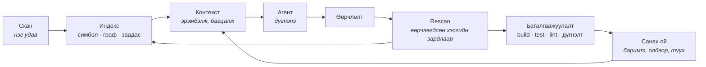

<div align="center">

# Nexus

### AI кодын агентад зориулсан инженерийн ухааны давхарга

*Кодыг нэг удаа ойлгоод, дараа нь санана.*

[](https://github.com/zorigtbaatarAst/nexus/actions/workflows/ci.yml)
[](https://www.rust-lang.org)
[](#nexus-өөр-дээрээ)
[](LICENSE)
[](docs/mcp-api.md)

*[English](README.en.md) · **Монгол***

</div>

---

## Философи

### Асуудал нь ухаан биш. Асуудал нь мэдэхгүй байх нь

Орчин үеийн кодын агентууд сайн бодож чадна. Зөв таван файл, зөв гурван баримтыг нь өгвөл
туршлагатай инженерийн гарын үсэг зурах ажлыг хийж өгнө.

Алдаа нь **бодохоос өмнө** гардаг: агент аль таван файл болохыг мэдэхгүй, тэр гурван баримт
юу болохыг мэдэхгүй, мэдэх ганц арга нь — уншиж эхлэх. Мөр мөрөөр, өндөр үнээр, дараа нь
дотор нь бодох ёстой тэр л контекст цонх руу.

Бусад бүх шинж тэмдэг үүнээс урган гардаг.

### Илүү контекст биш. **Дээр** контекст

> **AI-д илүү контекст бүү өг. Дээр контекст өг.**

Илүүг өгөх нь хялбар бөгөөд бодитоор хортой. Токен нь мөнгө, анхаарлыг сарниулж, чухал гурван
мөрийг чухал бус дөрвөн зуун мөрийн доор булна. Харин *дээр* контекст гэдэг нь **сонголтын
асуудал** — сонголт нь эрэмбийн асуудал, эрэмбэ нь детерминистик тооцоолол, тооцоолол нь бараг
үнэгүй.

Хэмжсэн жишээ: энэ repo дээр нэг хамаарлын асуултад арван файл уншвал **~34,000 токен**, эцэст
нь хариу нь хаана ч бичигдээгүй тул *таамаг* хэвээр. Индексээс уншвал нотлогдсон хариу
**~1,500 токен**. Энэ харьцаа л бүтээгдэхүүн нь мөн.

### Хөдөлмөрийн хуваарь

> **Nexus нотолгоо, түүх, баталгаажуулалтыг хариуцна. Агент дүгнэлтийг хариуцна.**

Энэ бол тав тухын шийдвэр биш, шударга байдлын шийдвэр: **нотолгоо цуглуулж буй бүрэлдэхүүн нь
дүгнэлт гаргаж буй бүрэлдэхүүн байх ёсгүй.** Тэгж байж бие даасан хяналт үүснэ. Онош тавьж,
эмчилгээ нь бас өөрөө хийдэг хэрэгсэлд өөрийг нь шалгах хэн ч байхгүй.

Кодын дотор энэ нь ганц дүрэм болж хувирна: таних тэмдэг, амьдралын мөчлөг, хадгалалт нь
платформынх; **зөвхөн дүрэм** нь capability-ийнх.

### Детерминистик нь эхэнд, магадлалт нь араас

Асуулт бүрийг эхлээд query-ээс асууна, дараа нь л model-оос. Ихэнх асуулт model хүртэл огт
хүрэхгүй.

Энэ нь даяанчлал биш. *"Энэ методыг юу дууддаг вэ?"* гэж model-оос асуувал индексээс асуухаас
удаан, үнэтэй, бас **бүр буруу** байна. Join хийвэл болох газар токен зарцуулах нь — мөнгө
төлж муудах хэрэг.

### Санах ой гэдэг нь дахин бодохгүй байх

Өнгөрсөн мягмар гарагт дөчин минут зарцуулж, idempotency нь service дээр биш controller дээр
хэрэгждэг гэдгийг олж мэдсэн агент өнөөдөр түүнийг мэдэхгүй. Тэр дүгнэлт бодит токен, бодит цаг
зарцуулж гарсан бөгөөд сешн дуусахад ууршсан.

> **Үнэтэй дүгнэлтэд ганц удаа хүрэх ёстой.**

Nexus баримтыг нотолгоотой нь хамт хадгална, скан бүрт дахин шалгана, нотолгоо нь хөдөлбөл
хүчингүй болгоно — устгахгүй. Хуучирсан санах ой бол эрх мэдэлтэй сонсогддог алдаа юм.

### "Дууслаа" гэдэг бол мэдэгдэл

Агент ажлаа дуусгаад "дууслаа" гэж хэлэхэд түүнийг хэн ч компайл хийж, тест ажиллуулж,
шалгадаггүй. Агент худлаа хэлээгүй — тэр зүгээр л **мэдэх боломжгүй**, учир нь баталгаажуулах
суваг нь байгаагүй.

> **"Дууслаа" гэдэг бол ертөнцийн тухай мэдэгдэл. Баталгаажуулалт л түүнийг баримт болгоно.**

---

## Юу болох вэ

Nexus бол кодын агент биш, multi-agent framework биш, linter, indexer, RAG систем ч биш.

**Nexus бол таны төслийг аль хэдийн мэддэг тэр зүйл** — ингэснээр дотор нь ажиллаж буй агент
сешн бүрт, `Read` дуудалт бүрээр, бүтэн үнээр дахин олж мэдэх шаардлагагүй болно.

Туршлагатай ахлах инженер таны төсөлд ирэхдээ шинэ агентын хийж чаддаггүй дөрвөн зүйлийг хийдэг:

| Ахлах инженер | Өнөөдрийн агент | Nexus юу өгөх вэ |
|---|---|---|
| Файл нээхээсээ өмнө систем нь **юу болохыг** мэднэ | Хамгийн түрүүнд нээсэн файлаасаа таамаглана | `detect` профайл, хадгалагдсан |
| Энэ модуль өнгөрсөн улиралд **эвдэрсэн**, яаж эвдэрснийг мэднэ | Сешн хооронд санах ойгүй | Түүхтэй олдвор, нотолгоотой баримт |
| Энд хийсэн өөрчлөлт **frontend хүртэл хүрэхийг** мэднэ | Харж чадахгүй — `fetch('/api/x')`-ийг `@QueryMapping`-тэй холбох юм эх бичвэрт байхгүй | Хамаарлын граф дахь GraphQL/HTTP заадас |
| Компайл хийж, тест давахаас нааш **"дууслаа" гэдэгт итгэдэггүй** | "Дууслаа" гэнэ | Баталгаажуулалтын хаалга |

Nexus бол яг энэ дөрөв — асуумжлах боломжтой, тогтвортой, хямд болгосон нь.

---

## Мөчлөг



Бүх repo-г уншдаг цорын ганц удаа бол эхний `scan`. Дараа нь **байгаа кодын хэмжээгээр биш,
өөрчлөгдсөн хэсгийн хэмжээгээр** зардал гаргана.

---

## Суулгах

```bash
curl -fsSL https://raw.githubusercontent.com/zorigtbaatarAst/nexus/main/install.sh | sh
```

Ганц файл татаж, checksum-ыг шалгаад суулгана. Java, Node, Docker — юу ч хэрэггүй.

```bash
cd /таны/төслийн/зам

nexus scan                      # индекслээд baseline тавина
nexus rescan                    # юу өөрчлөгдсөн, тэр нь юунд нөлөөлөх вэ
nexus context --task "..."      # энэ ажилд хэрэгтэй контекст, эрэмбэтэй
nexus analyze                   # capability ажиллуулна
nexus verify                    # build · test · lint → дүгнэлт
nexus ask next                  # юуг эхлэж харах нь зүйтэй вэ
```

Хоёр binary суулгагдана: `nexus` — платформ, `bughunter` — capability-ийн өөрийнх нь CLI.
Хоёул нэг файл, зөвхөн нэрээрээ ялгаатай (`argv[0]`-оор шийднэ). `init` тусад нь ажиллуулах
шаардлагагүй — `scan` шаардлагатай бол өөрөө бэлдэнэ.

### Claude Code plugin

```
/plugin marketplace add zorigtbaatarAst/nexus
/plugin install nexus@nexus
```

MCP сервер, slash командууд, мөн агентад **хэзээ** хандах, хариуг нь **хэрхэн унших**-ыг
заасан skill суулгагдана. Зөвхөн MCP сервер бол:
`claude mcp add --scope user nexus -- nexus mcp`.

Hook-ууд `nexus init --hooks` гэж асаана — **өгөгдмөлөөр унтарсан**. Хэмжигдээгүй hook-ыг
хүний ажлын урсгал руу дуудалгүй тавих нь яг л энэ төслийн зорилготой зөрчилдөнө.

<details>
<summary>Бусад аргууд · шинэчлэх · устгах</summary>

```bash
# эх кодоос build (Rust хэрэгтэй)
curl -fsSL .../install.sh | sh -s -- --from-source

# тодорхой хувилбар, өөр хавтас
... | sh -s -- --version v0.3.0 --dir ~/bin

# устгах
... | sh -s -- --uninstall

# repo-г clone хийсэн бол
make install

# Claude Code plugin-ийг тусад нь шинэчилнэ
/plugin marketplace update nexus
```

Binary болон plugin тусдаа: нэгийг нь шинэчлэхэд нөгөө нь шинэчлэгдэхгүй. Схем binary-аасаа
хуучин бол `nexus doctor` хэлж өгнө; `nexus rescan` засна.

</details>

Ямар нэг зүйл болохгүй бол `nexus doctor`. Юу дутуу байгааг, яаж засахыг тухайн командтай нь
хамт хэлнэ.

---

## Баталгаа

Гурван зүйлийг амласан биш, **хэмжсэн** байдлаар.

### 1 · Форматлалт нь өөрчлөлт биш

109 файлтай Spring Boot төслийг бүхэлд нь дахин форматлав — диск дээр 14,000 мөр хөдөлсөн:

```
Changes
  109 files
  0 symbols        ← нэг ч симбол өөрчлөгдөөгүй
```

`spotlessApply` ажиллуулах бүрт дэмий алдаа хайхгүй. Харин нэг методын дотор нэг мөр
өөрчлөхөд:

```
BODY_CHANGED    mn.life.wellbeing.service.WellbeingService#saveMeal(SaveMealInput)
```

Яг тэр метод. "WellbeingService.java өөрчлөгдсөн" гэсэн бүдэг хариу биш.

### 2 · Frontend, backend хоёрын хоорондох заадас

Хамгийн хэцүү асуулт: *"Backend дээрх энэ методыг өөрчилвөл frontend дээр юу эвдрэх вэ?"*
Ихэнх tool хариулж чаддаггүй, учир нь `fetch()` ба `@QueryMapping` бол өөр өөр хэлэн дээрх,
эх бичвэрт нь ямар ч холбоогүй хоёр функц. Nexus тэднийг **GraphQL схемээр** холбоно — схем нь
хоёр талын хоорондох гэрээ учраас.

```
$ nexus impact 'mn.autoland.sales.vehicle.service.VehicleService#list' --paths

  0.81  VehicleGraphQLController#vehicles(...)
  0.57  graphql:Query.vehicles
  0.46  graphql:op:Vehicles
  0.37  frontend/src/app/(sales)/vehicles/page#VehiclesPage
  0.37  frontend/src/app/(sales)/components/NewSaleModal#NewSaleModal
  0.37  frontend/src/app/(sales)/components/VehicleSelect#VehicleSelect
  …
  7 crossing the frontend/backend seam
```

Java методын нэг мөр өөрчлөхөд **зургаан React компонент** эрсдэлд орж байгааг, холбогдсон
замтай нь хамт харууллаа. Хэмжсэн: 880 файл, 5,665 симбол, дотоод хамаарлын **96% холбогдсон**,
641 мс.

### 3 · Nexus өөрийгөө индексэлнэ

Хамгийн шударга сорил бол хэрэгслийг өөр дээр нь ажиллуулах:

```
261 файл · 1,831 симбол · 4,158 хамаарал
```

Урьд нь энэ тоо **0 симбол, 0 хамаарал** байсан — Nexus бүх төслийг тайлбарлаж чаддаг байсан
ч өөрийгөө чаддаггүй байлаа. Rust анализатор түүнийг хаасан.

---

## Хийж чадах зүйлс

| Команд | Хариулах асуулт |
|---|---|
| `nexus scan` · `rescan` | Энэ юу вэ? Юу өөрчлөгдсөн бэ? |
| `nexus context --task "…"` | Энэ ажилд яг юу хэрэгтэй вэ — эрэмбэтэй, токены хязгаартай, **яагаад** гэдгийг нь хамт |
| `nexus impact <target>` | Үүнийг өөрчилвөл юу эвдрэх вэ — бүх stack-аар |
| `nexus analyze [cap]` | `architect` · `review` · `bughunter` |
| `nexus verify` | Компайл хийж, тест давж, lint өнгөрч байна уу — baseline-тай харьцуулж |
| `nexus fact` · `memory export` | Санаж үлдээх, хүнд уншигдах хэлбэрээр гаргах |
| `nexus share export/import` | Хоёр машины хооронд — сервергүйгээр |
| `nexus mcp` | Ямар ч MCP агентад зориулсан 19 tool |

Гурван capability нэг индекс уншина — ажлын гурван мөчид нэг нэг:

| Мөч | Capability | Асуулт |
|---|---|---|
| Эхний скан | **Architect** | Энэ төсөл юугаар бүтсэн, юу дутуу вэ? |
| Засварын дараа | **Review** | Энэ өөрчлөлт юунд хүрэх вэ, юу түүнийг тестэлж байна вэ? |
| Сэжигтэй алдаа | **BugHunter** | Хаана байна, юу нотолж байна вэ? |

---

## Гол зарчмууд

1. **Шалгаж болох нотолгоо нь AI-н таамгаас дээр.** `file:line` заагаагүй олдвор
   хадгалагдахгүй — доогуур эрэмблэгддэггүй, хаягддаг.
2. **AI бол заавал биш.** Детерминистик build дотор HTTP client огт байхгүй — амлалт биш,
   `cargo tree`-ээр шалгагдах баримт.
3. **Repo-г бүтнээр нь хаашаа ч илгээхгүй.** Контекст гэдэг нь эрэмбэлэгдсэн, токены
   хязгаартай нотолгооны багц. "Файлыг бүтнээр нь оруулъя" гэсэн зам байхгүй.
4. **Продакшн кодыг өөрчлөхгүй.** Үүсгэсэн файлууд шорон дотор амьдарна; таны working tree
   хэзээ ч `checkout`, `stash`, `reset` хийгдэхгүй.
5. **Алдаа чимээгүй өнгөрөхгүй.** Уншиж чадаагүй файлаа хэлнэ; тасалдсан үр дүн тасалдсанаа
   хэлнэ; baseline олдохгүй бол бүтэн скан руу шилжээд **тэрийгээ хэлнэ**.
6. **Тодорхойгүй байдал бол хариу.** Аль хэдийн улаан байсан тест багц өөрчлөлтийн талаар юу ч
   нотлохгүй — тиймээс `Inconclusive` гэж хэлнэ, `Failed` гэж хэлэхгүй. Худал дуугардаг хаалгыг
   нэг удаа унтраадаг, тэгээд юу ч шалгагдахаа болино.
7. **Таамаглахгүй, асууна.** Дөрвөн боломжоос нэгийг чимээгүй сонгоод итгэлтэй дуугарах нь
   хамгийн муу хувилбар: тэр нь таамаг байсныг хэн ч мэдэхгүй өнгөрнө.

---

## Технологи

**Rust · ганц статик binary · SQLite · tree-sitter · git2.** 18 crate, ~32,000 мөр, 392 тест.

Java · TypeScript · GraphQL · **Rust** · **Python** — тав нь ажиллаж байна. Хэл бүр
`LanguageAnalyzer` интерфейсийн ард, **композицийн үндэс дээр бүртгэгддэг**: шинэ хэл нэмэх нь
шинэ crate, үндэс дээр нэг мөр — цөмийн засвар биш. Framework мэдлэг (Spring, Next.js, Django,
FastAPI) нь тусдаа өргөтгөлийн тэнхлэг — Spring гэдэг Java биш шүү дээ.

| Давхарга | Crate |
|---|---|
| Төрөл, хадгалалт, git | `nexus-types` · `nexus-store` · `nexus-vcs` |
| Хэл | `nexus-lang` · `-java` · `-ts` · `-graphql` · `-rust` · `-python` · `-pack` |
| Цөм | `nexus-core` — индекс, граф, контекст, санах ой, олдворын мөчлөг |
| Баталгаажуулалт | `nexus-verify` — процесс ажиллуулах, шорон, sandbox |
| Capability | `cap-architect` · `cap-review` · `cap-bughunter` |
| Адаптер | `nexus-mcp` · `nexus-cli` |

Хилүүд нь конвенц биш, **тест**: `crates/nexus-cli/tests/boundaries.rs` `cargo metadata`-г
уншаад зөрчлийг build дээр унагана.

---

## Nexus өөр дээрээ

```bash
make check        # CI-ийн ажиллуулдаг зүйл: fmt · clippy (warning = алдаа) · 392 тест
make fixtures     # benchmark корпус — тодорхойлолтоос, дандаа адилхан sha
/nexus-architect  # кодоос одоогийн байдлыг тогтоож, дараагийн даалгаврыг төлөвлөнө
```

Эхлээд [`AGENTS.md`](AGENTS.md)-г унш — өөрчлөгдөшгүй дүрмүүд, санаатай сонин зүйлс, цаг үрдэг
урхинууд тэнд байна.

---

## Баримт бичиг

Техникийн баримт бичиг англи хэл дээр.

| Файл | Тухай |
|---|---|
| [AGENTS.md](AGENTS.md) | **эхлээд үүнийг** — агентад зориулсан танилцуулга |
| [docs/architecture/](docs/architecture/README.md) | 14 баримт: алсын хараа, Context Engine, санах ой, баталгаажуулалт, үнэлгээ, 0–5 үе шат |
| [architecture.md](docs/architecture.md) · [architecture-decisions.md](docs/architecture-decisions.md) | давхарга, crate, хил · 25 ADR |
| [data-model.md](docs/data-model.md) · [change-analysis.md](docs/change-analysis.md) | SQLite схем · өөрчлөлт, нөлөөлөл, fingerprint |
| [memory-model.md](docs/memory-model.md) · [investigation.md](docs/investigation.md) | баримтын амьдралын мөчлөг · дэлгэцээс сэжигтэн хүртэл |
| [capabilities.md](docs/capabilities.md) · [mcp-api.md](docs/mcp-api.md) | capability гэрээ · MCP tool, зөвшөөрөл |
| [security.md](docs/security.md) · [verification-engine.md](docs/verification-engine.md) | аюулгүй байдал, sandbox, нууц · баталгаажуулалт |
| [cli-spec.md](docs/cli-spec.md) · [performance.md](docs/performance.md) · [roadmap.md](docs/roadmap.md) | CLI · гүйцэтгэл · төлөвлөгөө |

---

<div align="center">

**MIT** — [LICENSE](LICENSE)

*Nexus төслийг ойлгоно; capability-үүд тэр ойлголтыг ашиглана.*

</div>
