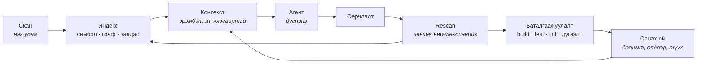

<div align="center">

# Nexus

### Кодын агентад зориулсан инженерийн санах ой

*Төслөө нэг удаа ойлгож аваад цаашид санаж явдаг.*

[](https://github.com/zorigtbaatarAst/nexus/actions/workflows/ci.yml)
[](https://www.rust-lang.org)
[](#nexus-өөр-дээрээ)
[](LICENSE)
[](docs/mcp-api.md)

*[English](README.en.md) · **Монгол***

</div>

---

## Хаанаас эхлэх вэ

| Юу хийх гэж байна | Хаашаа орох вэ |
|---|---|
| Шууд суулгаад үзэх | [Суулгах](#суулгах) → [Командууд](#командууд) |
| Юунд хэрэгтэйг нь ойлгох | [Асуудал](#асуудал) → [Дөрвөн дүрэм](#дөрвөн-дүрэм) |
| Үнэхээр ажилладаг эсэхийг шалгах | [Баталгаа](#баталгаа) |
| Claude Code-доо холбох | [Claude Code plugin](#claude-code-plugin) |
| Дотор нь орж ажиллах | [AGENTS.md](AGENTS.md) → [Технологи](#технологи) |
| Бүх баримтыг үзэх | [Баримт бичиг](#баримт-бичиг) |

---

## Асуудал

Өнөөдрийн кодын агентууд сайн боддог. Зөв файл, зөв баримтыг нь өгчихвөл туршлагатай
инженер шиг ажиллана.

Гэтэл асуудал нь бодохоос нь өмнө эхэлчихсэн байдаг. **Аль файлыг унших вэ? Ямар баримт нь
энэ ажилд хамаатай вэ?** Агент үүнийг мэдэхгүй. Мэдэх ганц арга нь уншиж эхлэх. Файл
файлаар, өндөр үнээр, яг бодоход нь хэрэгтэй байсан контекст цонхоо дүүргэсээр. Бусад бүх
асуудал эндээс үүдэлтэй.

> **AI-д их контекст өгөх хэрэггүй. Зөв контекстийг нь өг.**

Ихийг өгөх амархан ч хортой. Токен бүр мөнгө. Контекст дүүрэх тусам анхаарал нь сарнин
чанар унадаг. Хэрэгтэй гурван мөр нь хэрэггүй дөрвөн зуун мөрийн дунд алга болно.

Тоо болговол: энэ repo дээр нэг хамаарлын асуултад хариулъя гээд арван файл уншвал ~**34,000
токен** зарцуулна, хариулт нь бас таамаг хэвээрээ. Индексээс авбал нотлогдсон хариулт нь
~**1,500 токен**. Бүх учир нь яг энэ ялгаанд байгаа юм.

---

## Дөрвөн дүрэм

**1 · Эхлээд индексээс, дараа нь model-оос.**
«Энэ методыг хэн дууддаг вэ?» гэж model-оос асуувал индексээс асуухаас удаан, үнэтэй, бүр
**буруу** ч байж мэднэ. Нэг join-оор бүтэх зүйлд токен үрнэ гэдэг мөнгөө төлж байгаад
чанараа муутгаж байгаа хэрэг.

**2 · Nexus нотолгоог, агент дүгнэлтийг хариуцна.**
Энэ бол зүгээр нэг ажил хуваарилалт биш, шударга байдлын нөхцөл: **нотолгоо цуглуулдаг тал
нь дүгнэлт гаргадаг байж болохгүй.** Онош тавьсан хүн нь өөрөө эмчилж байвал түүнийг хэн ч
шалгахгүй. Код дээр энэ нь нэг дүрэм болж хувирдаг: таних тэмдэг, амьдралын мөчлөг,
хадгалалт бол платформынх. Capability зөвхөн **дүрмээ** мэднэ.

**3 · Үнэтэй дүгнэлтийг нэг л удаа гаргана.**
Өнгөрсөн долоо хоногт дөчин минут зарцуулж, idempotency-г service дээр биш controller дээр
шалгадаг юм байна гэдгийг олж мэдсэн агент өнөөдөр түүнийгээ санахгүй. Nexus баримтыг
нотолгоотой нь хамт хадгалж, скан бүрт дахин шалгадаг. Нотолгоо нь хөдөлбөл баримтыг
хүчингүй болгоно. Гэхдээ устгахгүй. Хуучирсан санах ой хамгаас аюултай: итгэлтэй
сонсогддог.

**4 · "Дууслаа" гэдэг мэдэгдэл, баримт биш.**
Агент «дууслаа» гэхэд компайл хийж, тест ажиллуулж шалгадаг хүн байдаггүй. Агент худал
хэлээгүй. Тэр зүгээр л **мэдэх аргагүй**: шалгах суваг нь анхнаасаа байгаагүй юм.
Мэдэгдлийг баримт болгодог ганц зүйл бол баталгаажуулалт.

---

## Nexus гэж юу вэ

Nexus бол кодын агент биш. Multi-agent framework ч биш, linter, indexer, RAG систем ч биш.

**Nexus бол таны төслийн тухай мэдлэгийг агентад зориулж хадгалдаг сан.** Ингэснээр дотор нь
ажиллаж байгаа агент сешн болгонд, `Read` дуудлага болгонд төсөлтэйгээ бүтэн үнээр дахин
танилцахаа больдог.

Туршлагатай ахлах инженер шинэ төсөлд ороход шинэ агентын хийж чаддаггүй дөрвөн зүйлийг
хийдэг:

| Ахлах инженер | Өнөөдрийн агент | Nexus юу өгөх вэ |
|---|---|---|
| Файл нээхээсээ өмнө энэ систем **юу болохыг** мэднэ | Анх нээсэн файлаасаа таамаглана | `detect` профайл, хадгалагдсан |
| Энэ модуль өнгөрсөн улиралд **эвдэрснийг**, яаж эвдэрснийг мэднэ | Сешн хооронд юу ч санахгүй | Түүхтэй олдвор, нотолгоотой баримт |
| Энд хийсэн өөрчлөлт **frontend хүртэл хүрдгийг** мэднэ | Харж чадахгүй — `fetch('/api/x')`-ийг `@QueryMapping`-тай холбох зүйл кодонд алга | Хамаарлын граф дахь GraphQL/HTTP заадас |
| Компайл хийгдэж, тест давахаас нааш **"дууслаа" гэдэгт итгэхгүй** | "Дууслаа" гээд орхино | Баталгаажуулалтын хаалга |

Nexus бол яг энэ дөрвийг асууж болохоор, санаж явдаг, хямд болгосон хувилбар нь юм.

### Мөчлөг



Бүх repo-г бүтнээр нь уншдаг цорын ганц үе бол анхны `scan`. Түүнээс хойш зардал нь **кодын
хэмжээнээс биш, өөрчлөлтийн хэмжээнээс** хамаарна.

---

## Суулгах

```bash
curl -fsSL https://raw.githubusercontent.com/zorigtbaatarAst/nexus/main/install.sh | sh
```

Нэг файл татаад checksum-ыг нь шалгаад суулгачихна. Java ч, Node ч, Docker ч хэрэггүй.

```bash
cd /таны/төслийн/зам
nexus scan                 # индекслээд baseline тавина
nexus context --task "..."  # энэ ажилд хэрэгтэй контекст
nexus ask next             # юунаас эхлэх вэ
```

Хоёр binary суудаг: `nexus` бол платформ, `bughunter` бол capability-ийн өөрийн CLI. Хоёулаа
нэг файл, зөвхөн нэрээрээ л ялгаатай (`argv[0]`-оор нь таньдаг). `init`-ийг тусад нь
ажиллуулах шаардлагагүй, `scan` хэрэгтэй бол өөрөө хийчихнэ.

Ямар нэг юм болохгүй бол `nexus doctor`-оо ажиллуул. Юу дутуу байгааг, яаж засахыг нь
командтай нь хамт хэлж өгнө.

### Claude Code plugin

```
/plugin marketplace add zorigtbaatarAst/nexus
/plugin install nexus@nexus
```

MCP сервер, slash команд, мөн агентад Nexus-ийг **хэзээ** ашиглах, хариултыг нь **яаж
унших** тухай заасан skill нь хамт суудаг. Зөвхөн MCP сервер хэрэгтэй бол:
`claude mcp add --scope user nexus -- nexus mcp`.

Hook-уудыг `nexus init --hooks` гэж асаана. **Анхнаасаа унтраастай** байдаг. Хүний ажлын
урсгалд асуулгүйгээр hook суулгана гэдэг энэ төслийн зорилгод шууд харш.

<details>
<summary>Бусад арга · шинэчлэх · устгах</summary>

```bash
# эх кодоос build хийх (Rust хэрэгтэй)
curl -fsSL .../install.sh | sh -s -- --from-source

# тодорхой хувилбар, өөр хавтас
... | sh -s -- --version v0.3.0 --dir ~/bin

# устгах
... | sh -s -- --uninstall

# repo-г clone хийсэн бол
make install

# Claude Code plugin тусдаа шинэчлэгдэнэ
/plugin marketplace update nexus
```

Binary болон plugin хоёр тусдаа: нэгийг нь шинэчилсэн ч нөгөө нь шинэчлэгдэхгүй. Өгөгдлийн
сангийн схем binary-аасаа хоцорсон бол `nexus doctor` хэлж өгнө, `nexus rescan` засна.

</details>

---

## Командууд

| Команд | Хариулах асуулт |
|---|---|
| `nexus scan` · `rescan` | Энэ юу вэ? Юу өөрчлөгдсөн бэ? |
| `nexus context --task "…"` | Энэ ажилд яг юу хэрэгтэй вэ — эрэмбэтэй, токены хязгаартай, **яагаад** гэдгийг нь хамт |
| `nexus impact <target>` | Үүнийг өөрчилбөл юу эвдрэх вэ — бүх stack даяар |
| `nexus analyze [cap]` | `architect` · `review` · `bughunter` |
| `nexus verify` | Компайл хийгдэж, тест давж, lint өнгөрч байна уу — baseline-тай харьцуулж |
| `nexus fact` · `memory export` | Санаж авах; хүн уншихаар гаргах |
| `nexus share export/import` | Хоёр машины хооронд — сервергүйгээр |
| `nexus mcp` | MCP ойлгодог ямар ч агентад зориулсан 20 tool |

Гурван capability нэг индексийг уншина. Ажлын гурван мөчид тус бүр нь нэг:

| Мөч | Capability | Асуулт |
|---|---|---|
| Анхны скан | **Architect** | Энэ төсөл юугаар бүтсэн бэ, юу дутуу байна вэ? |
| Засварын дараа | **Review** | Энэ өөрчлөлт юунд хүрэх вэ, юу үүнийг тестэлдэг вэ? |
| Сэжигтэй алдаа | **BugHunter** | Хаана байна вэ, юу нотолж байна вэ? |

→ Дэлгэрэнгүй: [cli-spec.md](docs/cli-spec.md) · [capabilities.md](docs/capabilities.md) ·
[mcp-api.md](docs/mcp-api.md)

---

## Баталгаа

Амлалт биш. **Хэмжиж үзсэн** гурван зүйл.

### 1 · Форматлах нь өөрчлөлт биш

109 файлтай Spring Boot төслийг бүхэлд нь дахин форматлаж үзлээ. Диск дээр 14,000 мөр
хөдөлсөн:

```
Changes
  109 files
  0 symbols        ← нэг ч симбол өөрчлөгдөөгүй
```

Ингэснээр `spotlessApply` болгоны дараа хоосон алдаа хайхаа больдог. Харин нэг мөр
өөрчилбөл:

```
BODY_CHANGED    mn.life.wellbeing.service.WellbeingService#saveMeal(SaveMealInput)
```

Яг тэр метод. «WellbeingService.java өөрчлөгдлөө» гэсэн бүрхэг хариу биш.

### 2 · Frontend, backend хоёрын заадас

Хамгийн хэцүү асуулт нь: «Backend-ийн энэ методыг өөрчилбөл frontend дээр юу эвдрэх вэ?»
`fetch()` ба `@QueryMapping` бол хоёр өөр хэл дээрх, код дээрээ хоорондоо ямар ч холбоогүй
хоёр функц. Тийм учраас ихэнх хэрэгсэл үүнд хариулж чаддаггүй. Nexus тэднийг **GraphQL
схемээр** холбодог. Схем бол хоёр талын хооронд байгуулсан гэрээ шүү дээ.

```
$ nexus impact 'mn.autoland.sales.vehicle.service.VehicleService#list' --paths

  0.81  VehicleGraphQLController#vehicles(...)
  0.57  graphql:Query.vehicles
  0.46  graphql:op:Vehicles
  0.37  frontend/src/app/(sales)/vehicles/page#VehiclesPage
  0.37  frontend/src/app/(sales)/components/NewSaleModal#NewSaleModal
  0.37  frontend/src/app/(sales)/components/VehicleSelect#VehicleSelect
  …
  7 crossing the frontend/backend seam
```

Java методын нэг мөр **зургаан React компонентыг** эрсдэлд оруулж байна. Хүрч очсон замыг нь
бас хамт үзүүлж байгаа. Java монорепо дээр хэмжихэд: 880 файл, 5,665 симбол, дотоод
хамаарлын **96% нь холбогдсон**, 641 мс. Энэ хувь хэлнээсээ хамаардаг. Java дуудлага бүрэн
нэрээ авч явдаг бол Rust, JavaScript нь зөвхөн методын нэрийг өгдөг. Энэ repo дээр 45%
(3,925 дуудлагын цэгээс 1,778, `26b121d`).

Энэ тоо бол *хамрах хүрээ*, өөрөөр хэлбэл очих цэгээ олсон дуудлагын цэгийн хувь. Холбоос
биш дуудлагын цэгийг тоолдог: олон нэр дэвшигчтэй үед нэг цэг олон холбоос үүсгэдэг тул
тодорхойгүй байх тусам тоо нь өсдөг байсан юм.

**Хамрах хүрээ гэдэг нарийвчлал биш**, хоёрыг нь одооноос тусад нь хэмждэг боллоо. Жинхэнэ
компайлерын frontend болох `rust-analyzer`-ийн SCIP индексийг эталон болгож, нэрээр нь биш
байрлалаар нь тулгахад очих цэг нь холбоос тутамд **72.3%** тохирч байна ([0.700–0.745],
1,528 холбоос шүүгдсэн). Дуудлагын цэгийн **71.5%** нь ганцхан нэр дэвшигчтэй бөгөөд тэр нь
зөв гарсан. Зөвхөн Rust, зөвхөн энэ repo, 4,232 цэгээс 1,368 нь харьцуулагдахуйц байсан:
арга зүй, болзолыг нь `make eval` болон [`docs/eval/`](docs/eval/README.md) дээрээс үз.

### 3 · Nexus өөрийгөө индекслэнэ

Хэрэгслийн хамгийн шударга шалгалт бол өөр дээр нь ажиллуулж үзэх:

```
289 файл · 2,074 симбол · 4,879 хамаарал
```

Урьд нь энэ тоо **0 симбол, 0 хамаарал** байсан. Nexus бусад бүх төслийг тайлбарлаж чаддаг
атлаа өөрийгөө чаддаггүй байсан юм. Rust анализатор энэ цоорхойг хаасан.

---

## Зарчмууд

1. **Шалгаж болох нотолгоо AI-н таамгаас дээр.** `file:line` заагаагүй олдворыг доогуур
   эрэмбэлэхгүй, шууд хаяна.
2. **AI заавал хэрэггүй.** Детерминистик build дотор HTTP client огт байхгүй. Амлалт биш,
   `cargo tree`-гээр шалгачихаж болох баримт.
3. **Repo-г бүхлээр нь хаашаа ч илгээхгүй.** Контекст гэдэг эрэмбэлсэн, хязгаартай нотолгооны
   багц. "Файлыг бүхлээр нь оруулъя" гэсэн зам байхгүй.
4. **Продакшн кодонд гар хүрэхгүй.** Таны working tree дээр хэзээ ч `checkout`, `stash`,
   `reset` хийхгүй. Үүсгэсэн файл нь зөвхөн өөрийн тусгай хавтастаа амьдарна.
5. **Алдаа чимээгүй өнгөрөхгүй.** Уншиж чадаагүй файлаа хэлнэ. Тасарсан үр дүн тасарснаа
   хэлнэ. Baseline олдохгүй бол бүтэн скан хийгээд **тэрийгээ хэлнэ**.
6. **«Тодорхойгүй» гэдэг бас хариулт.** Урьдаас улаан байсан тест багц энэ өөрчлөлтийн талаар
   юу ч хэлж чадахгүй. Тиймээс `Failed` биш `Inconclusive` гэдэг. Дэмий сүрдүүлдэг хаалгыг
   хүн нэг л удаа унтраадаг, тэрнээс хойш юу ч шалгагдахаа болино.
7. **Таамаглахгүй, асууна.** Дөрвөн боломжоос нэгийг нь дуугүйхэн сонгочихоод итгэлтэй ярих
   нь хамгийн муу хувилбар: тэр нь таамаг байсныг хэн ч хэзээ ч мэдэхгүй өнгөрнө.

---

## Технологи

**Rust · нэг статик binary · SQLite · tree-sitter · git2.** 19 crate, ~37,000 мөр, 478 тест.

Java · TypeScript · **JavaScript** · GraphQL · **Rust** · **Python**, зургуулаа ажиллаж
байна. Хэл бүр `LanguageAnalyzer` интерфейсийн ард байрлаж, **композицийн үндэс дээр
бүртгүүлдэг**. Шинэ хэл нэмнэ гэдэг шинэ crate, үндэс дээр нэг мөр нэмнэ гэсэн үг. Цөмд нь
гар хүрэхгүй. Framework-ийн мэдлэг (Spring, Next.js, Django, FastAPI) бол тусдаа өргөтгөлийн
тэнхлэг. Spring гэдэг Java биш шүү дээ.

| Давхарга | Crate |
|---|---|
| Төрөл, хадгалалт, git | `nexus-types` · `nexus-store` · `nexus-vcs` |
| Хэл | `nexus-lang` · `-java` · `-ts` · `-graphql` · `-rust` · `-python` · `-pack` |
| Цөм | `nexus-core` — индекс, граф, контекст, санах ой, олдворын мөчлөг |
| Баталгаажуулалт | `nexus-verify` — процесс ажиллуулах, шорон, sandbox |
| Capability | `cap-architect` · `cap-review` · `cap-bughunter` |
| Адаптер | `nexus-mcp` · `nexus-cli` |

Хил хязгаарууд нь тохиролцоо биш, **тест** юм: `crates/nexus-cli/tests/boundaries.rs` нь
`cargo metadata`-г уншаад зөрчил байвал build-ийг унагадаг.

### Nexus өөр дээрээ

```bash
make check        # CI-ийн ажиллуулдаг: fmt · clippy (warning = алдаа) · 478 тест
make eval         # холбогдсон холбоос нь *зөв* холбоос мөн үү — SCIP эталонтой тулгана
make fixtures     # benchmark корпус — тодорхойлолтоос, үргэлж ижил sha
/nexus-architect  # кодоос одоогийн байдлыг тогтоож, дараагийн даалгаврыг төлөвлөнө
```

Эхлээд [`AGENTS.md`](AGENTS.md)-г уншаарай. Хөдлөшгүй дүрмүүд, санаатай хийсэн сонин зүйлс,
цаг үрүүлдэг урхинууд бүгд тэнд байгаа.

---

## Баримт бичиг

Техникийн баримт бичиг англи хэл дээр.

| Файл | Тухай |
|---|---|
| [AGENTS.md](AGENTS.md) | **эхлээд үүнийг** — агентад зориулсан танилцуулга |
| [docs/architecture/](docs/architecture/README.md) | 15 баримт: алсын хараа, Context Engine, санах ой, баталгаажуулалт, үнэлгээ, 0–5 үе шат |
| [architecture.md](docs/architecture.md) · [architecture-decisions.md](docs/architecture-decisions.md) | давхарга, crate, хил · 26 ADR |
| [data-model.md](docs/data-model.md) · [change-analysis.md](docs/change-analysis.md) | SQLite схем · өөрчлөлт, нөлөөлөл, fingerprint |
| [memory-model.md](docs/memory-model.md) · [investigation.md](docs/investigation.md) | баримтын амьдралын мөчлөг · дэлгэцээс сэжигтэн хүртэл |
| [capabilities.md](docs/capabilities.md) · [mcp-api.md](docs/mcp-api.md) | capability-ийн гэрээ · MCP tool, зөвшөөрөл |
| [security.md](docs/security.md) · [verification-engine.md](docs/verification-engine.md) | аюулгүй байдал, sandbox, нууц · баталгаажуулалт |
| [cli-spec.md](docs/cli-spec.md) · [performance.md](docs/performance.md) · [roadmap.md](docs/roadmap.md) | CLI · гүйцэтгэл · төлөвлөгөө |

---

<div align="center">

**MIT** — [LICENSE](LICENSE)

*Nexus төслийг ойлгодог. Capability-ууд тэр ойлголтыг ашигладаг.*

</div>
