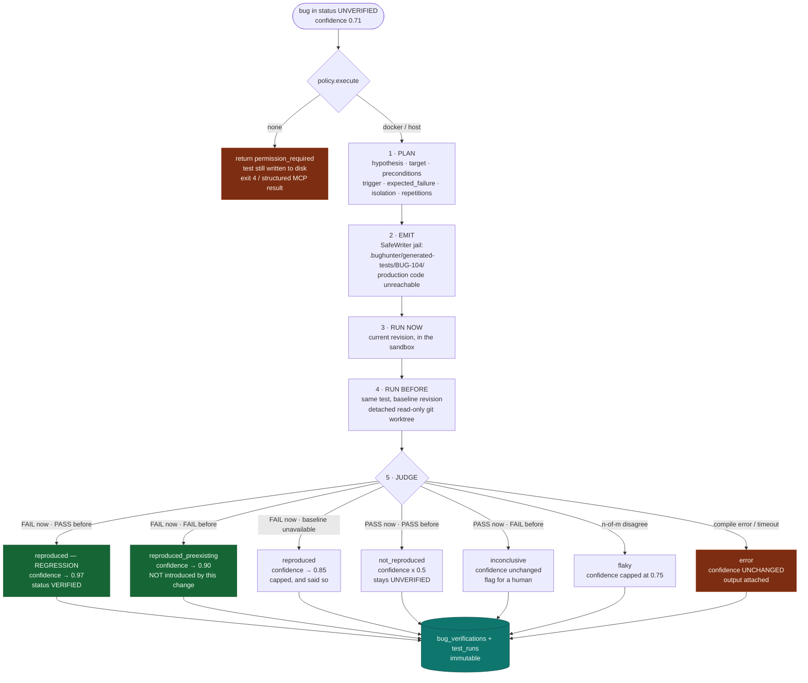
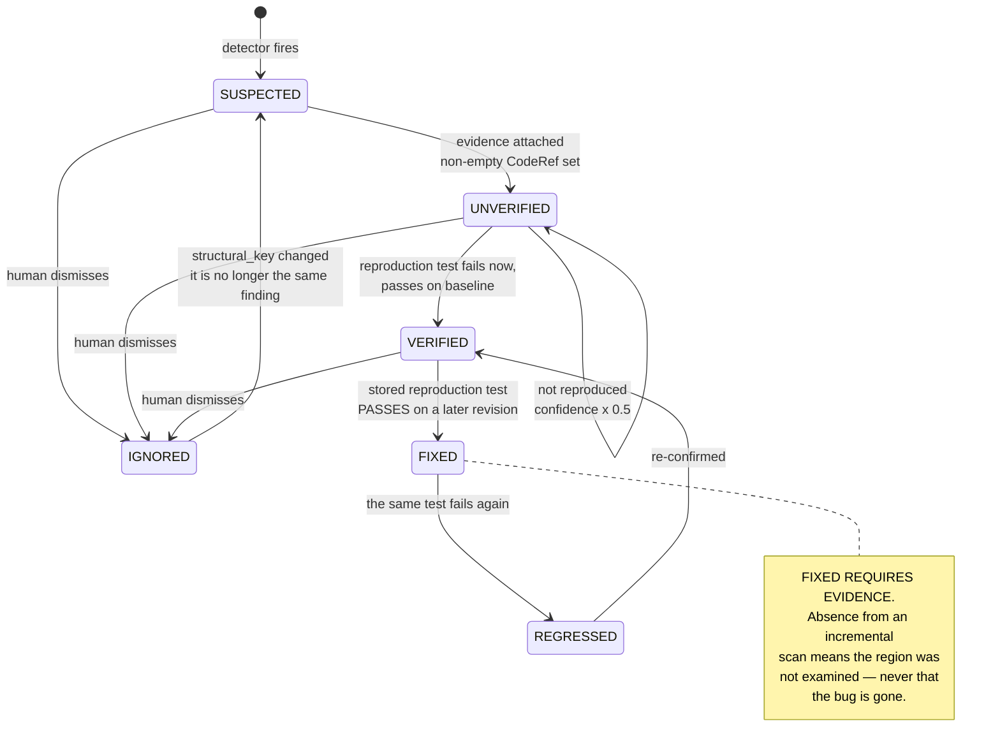
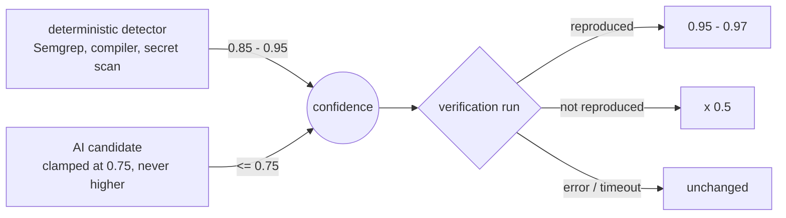

# Bug Verification Flow

The feature that separates a suspicion from a finding. Steps 1 and 2 may involve a model;
steps 3, 4 and 5 are entirely deterministic — and they decide the outcome.

**Step 4 is not optional polish.** Running the same generated test against the baseline
revision is the only way to tell "this change introduced a bug" from "this suite was already
red" — and therefore the only honest route from 71 % to 97 %.

**Step 7's rule matters as much:** an infrastructure failure leaves confidence *unchanged*.
Lowering it would punish the hypothesis for a broken pipe.

## Bug lifecycle

That note is the most important rule in the state machine. Without it, touching an unrelated
file silently closes real bugs, and the whole history becomes untrustworthy.

## Where confidence comes from

A model is not permitted to grade its own work: only the verification engine can push a bug
above 0.75, and only by reproducing it.
