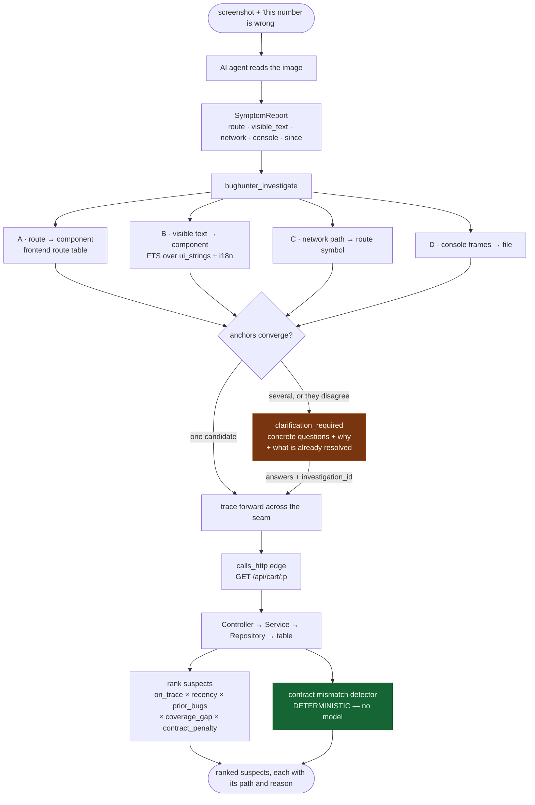
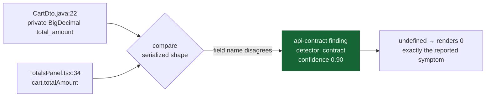
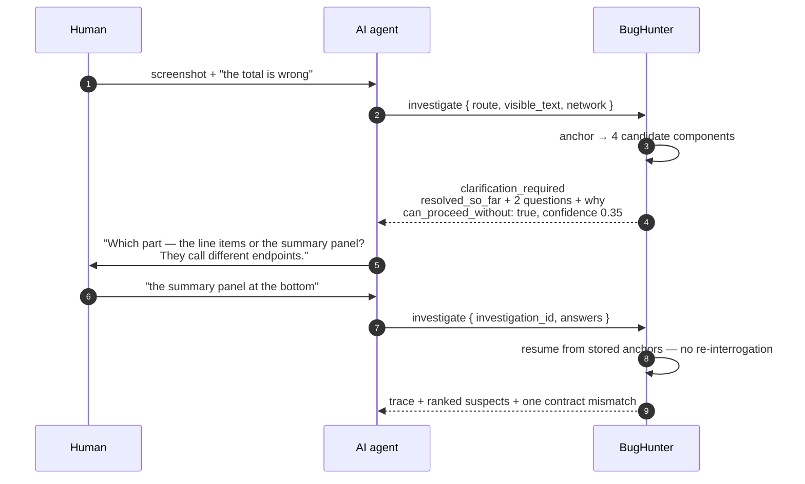

# Investigation Flow — from a screenshot to a suspect

The second entry point. The agent reads the image; BugHunter receives observations and
resolves them against the index it already holds.

**The image never enters BugHunter.** `SymptomReport.screenshot` holds a path and a hash for
provenance on the bug record; nothing opens it. Vision is reasoning, and reasoning belongs to
the agent.

## The seam

The dependency graph stops at each language boundary. Joining it at the HTTP contract is
what makes a UI symptom reachable to a repository method.

```mermaid
flowchart LR
    subgraph fe["frontend — nexus-lang-ts"]
        C1["TotalsPanel.tsx"] --> C2["useCart()"]
        C2 --> C3["fetch(`${API}/api/cart/${id}`)"]
    end
    subgraph canon["canonical join key"]
        K["GET /api/cart/:p"]
    end
    subgraph be["backend — nexus-lang-java"]
        S1["@GetMapping(&quot;/api/cart/{cartId}&quot;)"] --> S2["CartController#get"]
        S2 --> S3["CartService#totals"]
        S3 --> S4["CartRepository#findItems"]
        S4 --> S5[("cart_items")]
    end
    C3 -->|"dst_fqn_hint"| K
    K -->|"resolution = contract"| S1

    classDef seam fill:#1e3a8a,stroke:#1e40af,color:#eff6ff
    class K seam
```

Path parameters canonicalize positionally — `${id}`, `{id}`, `:id` and `<int:id>` all become
`:p` — so the two sides join without either knowing the other's naming. A frontend call with
no matching route stays `unresolved` and is **reported**, because a silently dropped edge
makes the trace lie by omission.

## Contract mismatch, found without a model

Confidence 0.90 is not subject to the 0.75 model clamp, because no model was asked. Both
sides are indexed; comparing them is a join.

## Asking, rather than guessing

A question is asked at most once per investigation, and only when the ambiguity was actually
measured. Asking something BugHunter already knows is how a tool teaches people to ignore its
questions.
