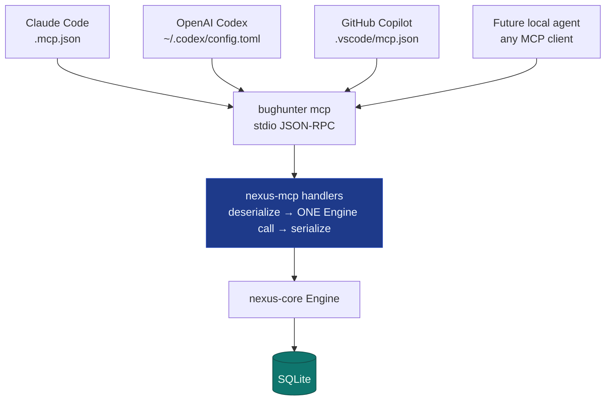
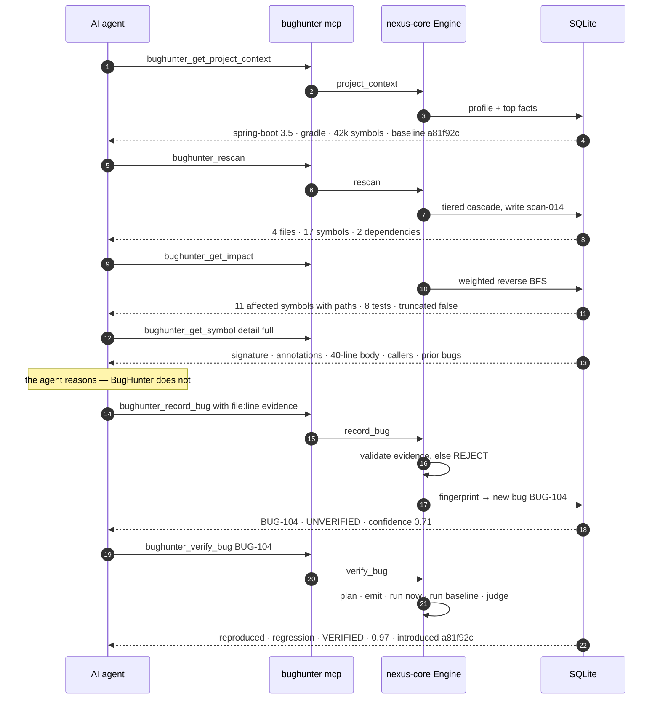
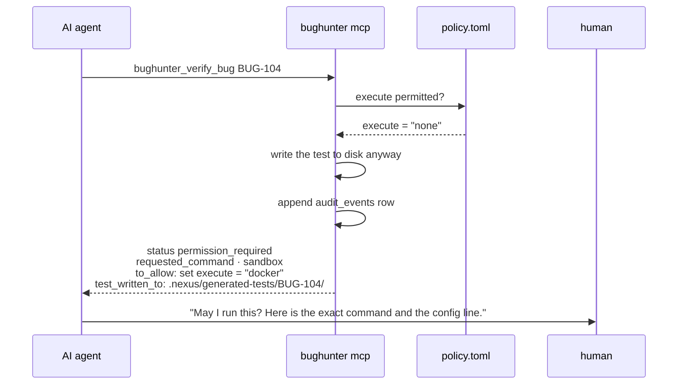
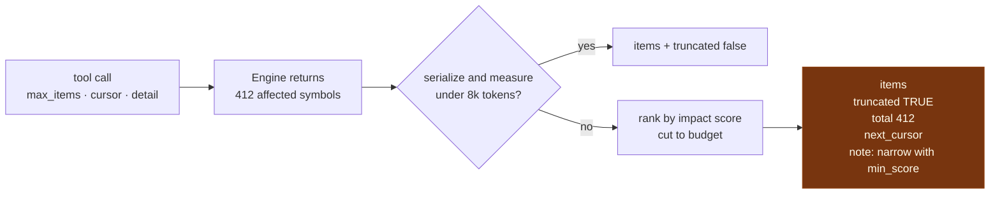
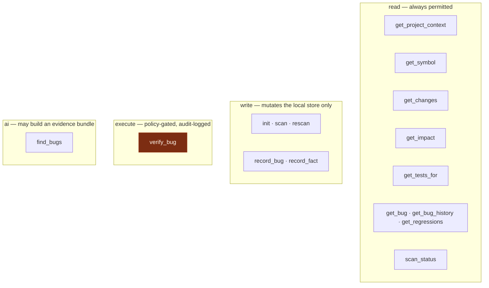

# MCP Integration

One server, one tool surface, every MCP-capable agent. No per-agent implementation exists in
the repository and none is planned.

Every client above is configured with the same two tokens: `command: "bughunter"`,
`args: ["mcp"]`. A new agent that supports MCP is supported on the day it ships.

## A typical agent session

No file is uploaded, no repository is traversed by the agent, and BugHunter calls no model.
The agent brought the reasoning; BugHunter brought the evidence, the history and the proof.

## Permission gating

An `execute`-class tool consults `policy.toml` before doing anything, and returns a
*structured refusal* rather than an error or a silent execution.

The brief's rule holds on both halves: never silently, and never without a policy a human
committed to the repository.

## Response budgeting

An agent's context is the scarcest resource in the system, so no tool may flood it.

Truncation is measured on the serialized payload, not guessed from item counts — and it is
never silent. An agent that does not know it received a partial answer will reason
confidently from it.

## Tool classes

There is no "run an arbitrary command" tool, and there will not be one in any version. The
allowlist in `policy.toml` is the entire execution surface.
