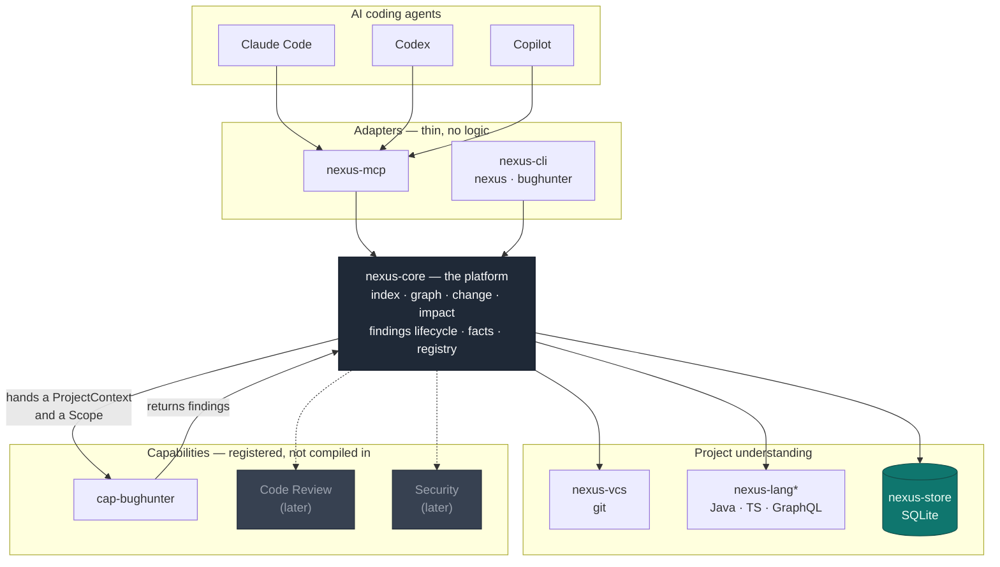
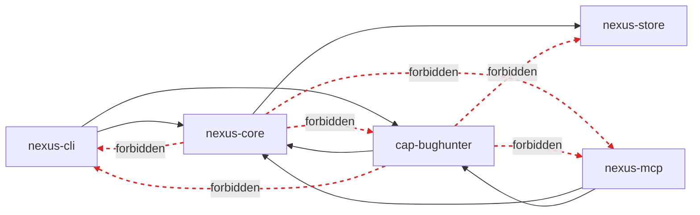

# Nexus — the platform shape

Nexus understands the project; capabilities use that understanding. Everything above the line
is the platform; everything below is a capability, and a capability is registered into the
platform rather than compiled into it.



## Forbidden edges

Dashed red is what `crates/nexus-cli/tests/boundaries.rs` fails the build on. These are not
conventions; the rules that make "add a capability later" true are checked mechanically.



`nexus-core ↛ cap-*` is the one that matters most. The reverse dependency would mean the
platform knows its capabilities, and "add Code Review later" would become a core change —
which is precisely the coupling this split exists to remove.

## Analysis, scoped

```mermaid
sequenceDiagram
    autonumber
    participant U as nexus analyze --changed
    participant E as Engine
    participant S as nexus-store
    participant C as cap-bughunter

    U->>E: analyze("bughunter", Scope::Changed)
    E->>S: symbols, edges, files, and what moved
    Note over E: the rescan cascade already worked out<br/>which symbols changed — this reads it,<br/>it does not recompute it
    E->>C: ProjectContext + Scope
    C->>C: ctx.scoped(scope) — narrow once, centrally
    C-->>E: findings (rules only; no storage, no git)
    E->>E: reject anything with no file:line evidence
    E->>S: upsert by (capability, fingerprint), append occurrence
    Note over E,S: new · recurring · regressed decided here,<br/>so no capability re-implements the answer
    E-->>U: AnalyzeReport, incl. symbols_examined
```

A narrowed run reports only what it examined, and **may not close what it did not look at** —
the fixed-sweep runs under `Scope::Everything` alone. Absence is evidence only when something
actually looked.
