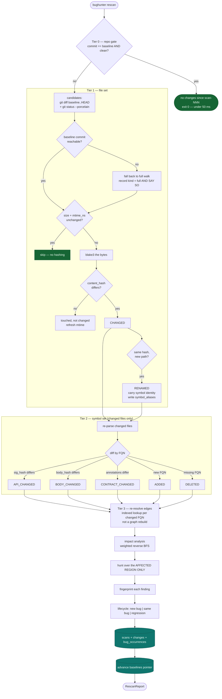
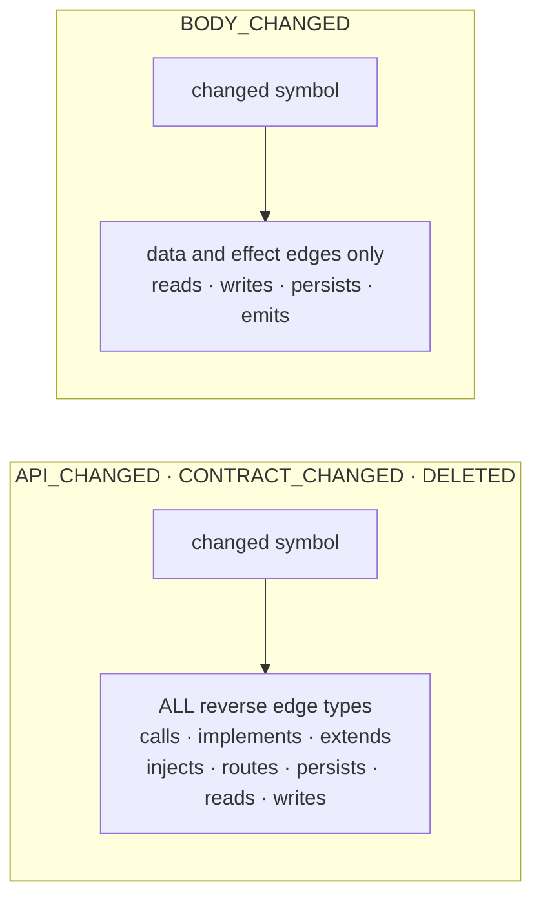
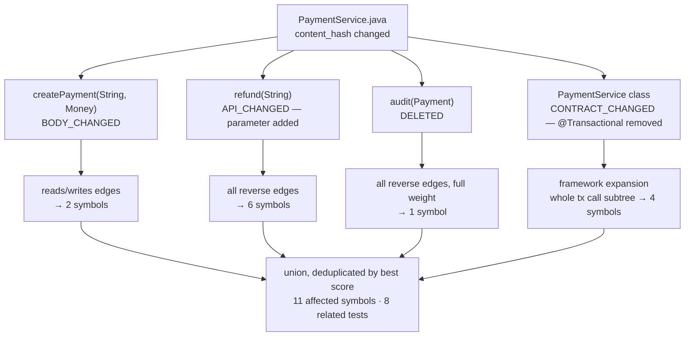

# Rescan Flow — the tiered cascade

The everyday command. Each tier's job is to make the next tier's input smaller, so cost is
proportional to *what changed* rather than to how much code exists.

## Why the change kind decides the ripple

The `sig_hash` / `body_hash` split exists so that a one-line edit does not fan out to the
entire reverse-reachable set.

A body-only edit cannot break a caller's compilation. It can only reach one through shared
state or an observable effect — so those are the only edges worth traversing, and filtering
there is what keeps an impact report to eleven symbols instead of four hundred.

## Worked example

One file, four different ripple rules. A file-granular tool reports "PaymentService changed"
and hands a model the whole class.
