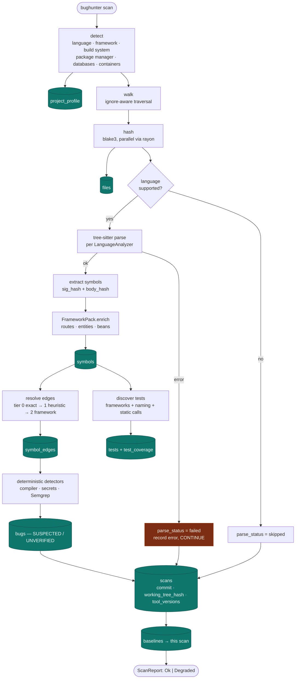
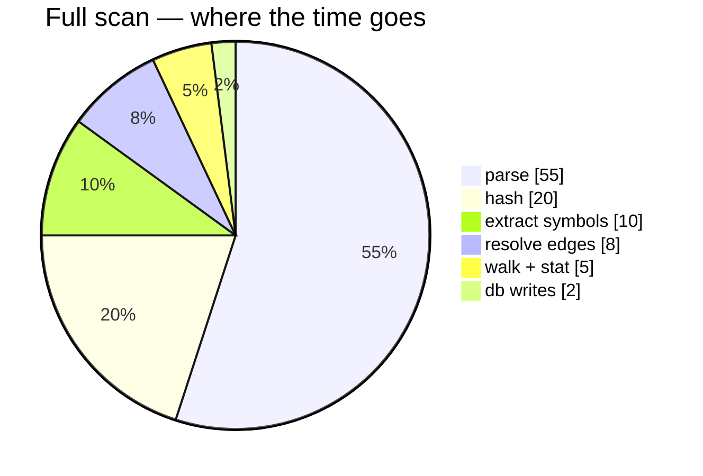

# Scan Flow — the first scan

`bughunter init` followed by `bughunter scan`. This is the only run that reads the whole
repository. Everything afterwards is incremental.

## Two things worth noticing

**A parse failure does not stop the scan.** It sets `files.parse_status = 'failed'`, records
the error, and the run continues, finishing with status `Degraded` and a visible
`2 files failed to parse` line. Aborting would make one bad generated file fatal; skipping
silently would make the index quietly wrong, which is worse.

**Edge resolution runs after every symbol exists.** Resolving an FQN needs the complete
symbol table, so it is a second pass over an immutable in-memory map — which is also why it
parallelizes cleanly.

## Phases and their cost

Parsing dominates, which is why the entire incremental design exists to avoid it.
