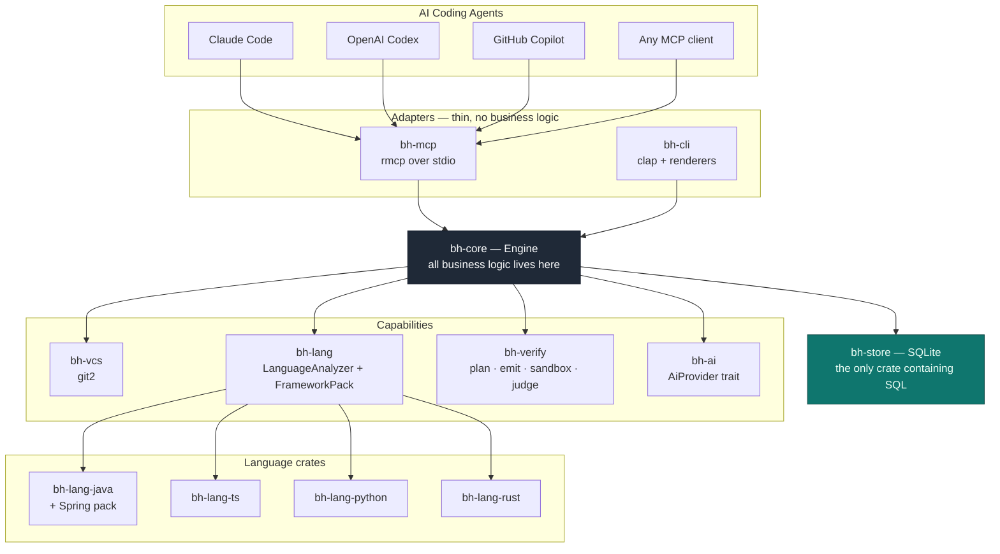
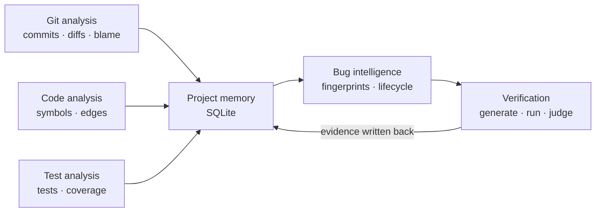
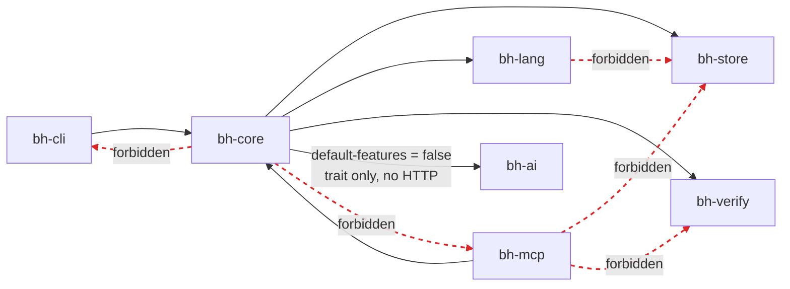
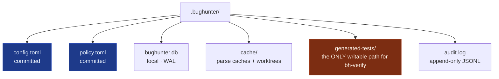

# System Architecture

The layer map. Every arrow points downward: `bh-core` has no knowledge that MCP, the CLI or
any AI provider exists.

## The intelligence pipeline

What the layers actually produce, in order:

## Boundary rules, as a graph

Dashed red edges are the dependencies a `cargo metadata` test forbids. These are what turn
the brief's constraints 1, 2, 3 and 12 into build failures rather than good intentions.

## On-disk state

